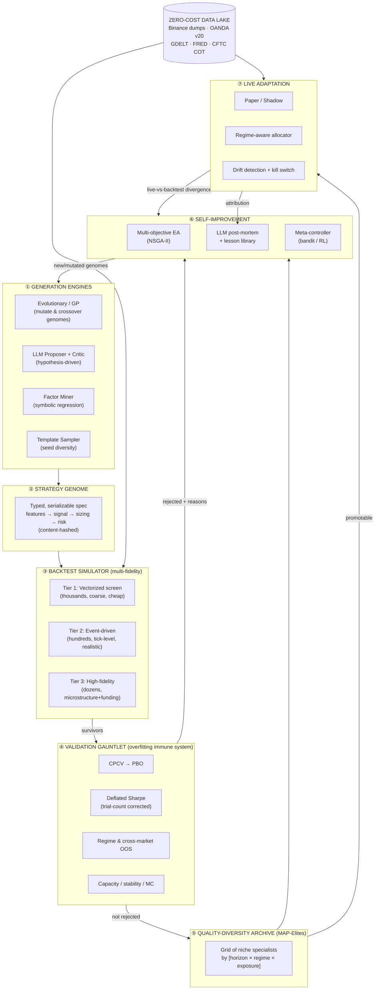
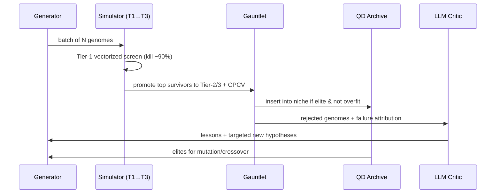
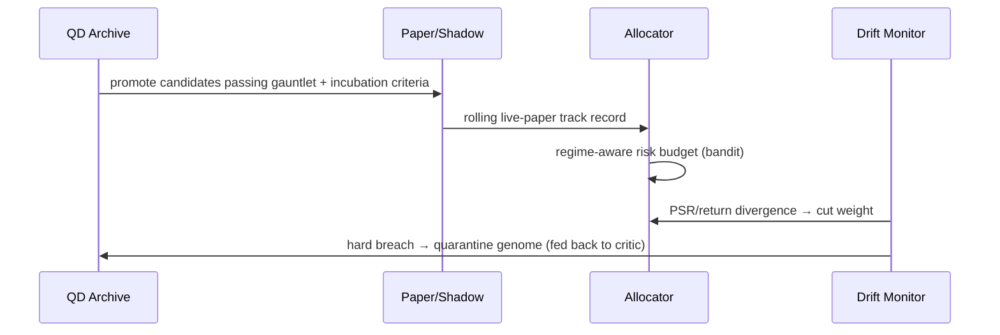

# 01 — System Architecture

## 1. The whole machine on one page

Master Trader is a **closed loop**. Ideas flow clockwise; capital and lessons flow back. Nothing is a dead end — a killed strategy still feeds the critic, and a live strategy that decays flows back to the archive as a cautionary genome.

**Reading the loop:** Generation → Genome → Simulate → Validate → Archive → Improve → (back to Generation), with a promotion tap from Archive into Live, and telemetry from Live feeding the critic. The **Data Lake** is the shared substrate touched by both the simulator and live trading — using the *identical* code path is what makes paper results predictive of live results (this is your existing "steps 1-8 are pure functions of the panel" principle from `backtest/engine.py`, generalized).

## 2. Subsystems at a glance

| # | Subsystem | One-line job | Reuses from your stack | Detail doc |
|---|-----------|--------------|------------------------|------------|
| ① | Generation Engines | Propose dozens of candidate strategies/day | broad primitive library (TA, statistical, microstructure, cross-asset, SMC, random) | [03](03_GENERATION_ENGINES.md) |
| ② | Strategy Genome | Represent a strategy as searchable data | new (the keystone) | [02](02_STRATEGY_GENOME_DSL.md) |
| ③ | Backtest Simulator | Score genomes fast → then honestly | `backtest/engine.py`, `costs.py` | [04](04_BACKTEST_SIMULATOR.md) |
| ④ | Validation Gauntlet | Try to *disprove* every survivor | `purged_cv.py`, `smc_monte_carlo.py`, DSR | [05](05_VALIDATION_GAUNTLET.md) |
| ⑤ | QD Archive | Keep a diverse stable, not one champion | new | [06](06_SELF_IMPROVEMENT_LOOP.md) |
| ⑥ | Self-Improvement | Reflect, mutate, reallocate search | `SMC_ML`, new LLM critic | [06](06_SELF_IMPROVEMENT_LOOP.md) |
| ⑦ | Live Adaptation | Promote, allocate, monitor, kill | `execution/shadow.py`, `xsec/regime.py` | [07](07_LIVE_ADAPTATION_AND_PORTFOLIO.md) |
| — | Data Lake | Point-in-time, survivorship-safe data | `core/smc_data.py`, scanners' feeds | [08](08_INFRASTRUCTURE_AND_DATA.md) |

## 3. The two control loops

The system runs at two clock speeds. Keeping them separate is what lets it be both *creative* (slow, expensive search) and *responsive* (fast, cheap adaptation).

### Inner loop — Discovery (minutes to hours)
Generate → screen → validate → archive → mutate. Throughput-oriented. Runs continuously on local CPU + burst on free GitHub Actions runners. Optimizes for *number of honestly-evaluated genomes per unit compute*.

### Outer loop — Deployment (hours to weeks)
Archive → promote to paper → allocate risk by regime → monitor drift → demote/kill. Safety-oriented. Runs on a schedule (APScheduler, exactly as your scanners already do). Optimizes for *risk-adjusted live survival*, not discovery.

## 4. Data-flow contract (why paper predicts live)

A single invariant governs correctness: **the feature computation, signal logic, and cost model used in backtest, paper, and live must be the same code.** Your `CC_Trading` already embodies this ("this identical code path underlies backtest, shadow, and live" — `backtest/engine.py`). Master Trader elevates it to a hard architectural rule:

- **One feature store.** Features are computed once, versioned, point-in-time, and consumed identically everywhere. No "backtest features" vs "live features."
- **One execution simulator interface.** Paper trading is the *same* event-driven simulator (Tier 2/3) fed a live data stream instead of a historical one. The only difference is the clock.
- **One cost model.** `costs.round_trip_cost` (yours) is charged in screening, validation, paper, and live-shadow accounting.

If those three are unified, a divergence between paper and live is *information* (regime change, capacity, or a data bug) rather than an unexplained mystery — and [07](07_LIVE_ADAPTATION_AND_PORTFOLIO.md)'s drift monitor can act on it.

## 5. State & registries (the system's memory)

Four durable stores, all free (SQLite/DuckDB/Parquet — see [08](08_INFRASTRUCTURE_AND_DATA.md)):

1. **Genome Registry** — every genome ever generated, content-hashed, with lineage (parents), generation, and generator. Deduplication happens here; you never pay to backtest the same idea twice.
2. **Result Ledger** — every evaluation of every genome at every fidelity, with the *exact* data snapshot id and RNG seed. This is what makes the Deflated Sharpe trial count *honest* — it literally counts the ledger.
3. **QD Archive** — the current elite map (best genome per behavioral niche) plus historical occupants.
4. **Lesson Library** — the LLM critic's accumulated, human-readable "trading wisdom": structured post-mortems and heuristics that condition future generation (the Voyager/Reflexion pattern, applied to markets).

## 6. Why this shape (design rationale)

- **Genome-as-data (②) is the keystone.** You cannot evolve, mutate, LLM-generate, or deduplicate free-form Python at scale. Representing strategies as typed specs makes every downstream capability possible. This is the single most important design decision in the system.
- **Multi-fidelity (③) is how "high-speed" and "realistic" coexist.** You cannot afford a tick-level sim for 10,000 candidates, and you cannot trust a vectorized sim for a live-bound strategy. So you use cheap sims to *rank* and expensive sims to *confirm* (successive halving / Hyperband over fidelity).
- **Gauntlet-before-archive (④→⑤) enforces the null hypothesis.** Nothing enters the stable of "real" strategies without surviving trial-count-corrected scrutiny. This is the firewall against the #1 killer.
- **Quality-diversity (⑤) over single-objective optimization** is a deliberate refusal to over-optimize. A grid of decent, *different* strategies is robust; one hyper-tuned champion is almost always an overfit ghost. It also directly delivers your requirement of "dozens of concurrent strategies."
- **Three feedback mechanisms (⑥), not one.** You asked about RL *or* evolutionary *or* LLM critique. The right answer is *all three, at the layer each is best at*: evolution for structural search, LLM for semantic reflection, bandits/RL for allocation and execution timing. [06](06_SELF_IMPROVEMENT_LOOP.md) explains the division of labor.
