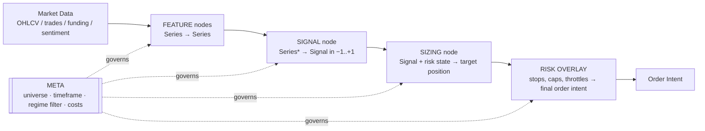

# 02 — The Strategy Genome DSL

> This is the keystone. Everything else — evolution, LLM generation, deduplication, safety — depends on strategies being *data*, not code.

## 1. The core idea

A strategy is represented as a **typed, serializable specification** called a *genome*: a small directed graph of typed operators that turns market data into positions. Because it is data, the system can generate it, mutate it, cross two of them, hash it, diff it, and reason about it in language — none of which is tractable with free-form Python.

Think of it as the DNA layer. The **phenotype** (actual returns) is produced by running the genome through the simulator ([04](04_BACKTEST_SIMULATOR.md)); the **genotype** (the spec) is what the search operates on.

## 2. Anatomy of a genome

A genome is a pipeline with five typed stages. Each stage draws from a registry of vetted primitives. Data types flow left to right and must type-check, so a randomly assembled genome is still structurally valid.



### Stage 1 — Features (`Series → Series`)

Pure, stateless transforms of a price/volume/context series. **This registry is deliberately vast and open-ended.** The design commitment here is *breadth without privilege*: no feature family is treated as "the edge" going in. SMC sits beside classical TA, beside raw statistics, beside microstructure, beside things with no story at all — and the [Validation Gauntlet](05_VALIDATION_GAUNTLET.md), not anyone's prior belief, decides what earns a place. The whole reason to represent strategies as data is so the machine can wire *any* of these together, including in combinations no human would think to try, and let the results speak. The families below are a *seed list*, not a ceiling — new primitives are added continuously (by you, by the Factor Miner, by the LLM), and every generator can use them the moment they exist.

- **Classical / technical:** returns at many horizons, z-scores, EMA/SMA distances & crossovers, ATR%, RSI, ADX, MACD, Stochastics, Bollinger position, Keltner, Donchian breakout distance, realized vol, VWAP distance, OBV. (You already compute a subset in `core/smc_data.py`, `SMC_ML/smc_ml_features.py` — but the registry is not limited to what you've built.)
- **Statistical / econometric:** autocorrelation, variance ratio, Hurst exponent, Kalman-filtered trend, GARCH/EWMA conditional vol, rolling skew & kurtosis, entropy, fractal dimension, cointegration / pairs residuals, PCA/eigen-portfolio loadings.
- **Microstructure / flow:** CVD, order-flow imbalance, aggressive-trade ratio, trade-size distribution, funding rate & funding z-score, open interest & OI change, long/short ratio, liquidation intensity, basis, roll yield. (Extends `xsec/factors/flow.py`, `carry.py`, `basis.py`.)
- **Pattern / shape:** candlestick patterns, shapelets, template/DTW matching, breakout & consolidation geometry, support/resistance density, gap statistics.
- **SMC / ICT (one family among many):** `fvg_present`, `order_block_strength`, `liquidity_swept`, `bos_choch_rank`, `displacement_atr`, `in_ote_zone`, `kill_zone_rank`, `amd_phase`, `smt_confirmed`. Your hand-crafted institutional-flow detectors (`concepts/*.py`) enter the pool as ready-made, high-quality primitives — *valuable, but not privileged.* They compete on the same footing as everything else and must earn their keep through the gauntlet like any random expression.
- **Cross-asset / intermarket:** DXY, gold, oil, rates, equity-index and BTC-dominance levels & changes; rolling correlations and lead-lag betas between instruments (crypto ↔ FX ↔ XAU ↔ macro). This is where "interlinked in ways we can't imagine" actually lives — the generator can condition a crypto signal on a gold-vs-dollar move and let the data judge it.
- **Cross-sectional:** rank-within-universe, BTC-beta residual, sector/cluster-neutralized value, dispersion. (Extends `xsec/neutralize.py`, `combine.py`.)
- **Regime / latent / ML-derived:** clustering or HMM regime labels, autoencoder/embedding features, change-point indicators, volatility-regime tags — features *produced by models* and then themselves used as inputs.
- **Seasonality / calendar:** time-of-day, day-of-week, session, funding-settlement proximity, expiry/roll windows, macro-event proximity.
- **Macro / sentiment / positioning:** COT positioning z-score (Asset-Managers vs. Leveraged-Funds), news-sentiment score, calendar-event surprise, risk-on/off gauge. (From the FX/XAU sentiment scanners and `Macro_Compass`.)

> **The point is expansion, not curation.** Start wide on purpose, wire families together promiscuously, and let the immune system prune. The only hard rules are that every primitive is point-in-time-safe (no look-ahead, [§7](#7-guardrails-baked-into-the-dsl)) and cost-aware — *not* that it come from any particular school of thought.

### Stage 2 — Signal (`Series* → Signal ∈ [−1, +1]`)
Combines feature series into a directional conviction. Signal operators:
- **Threshold/comparison** trees (`feature > k`, crossovers), **weighted blend** (z-score sum, the honest v1 from your `xsec/combine.py`), **logic gates** (AND/OR of conditions — your 5-gate architecture is exactly this), **learned combiner** (a small LightGBM/logistic head — reuses `SMC_ML`), **rank/percentile** cutoffs for cross-sectional books.

### Stage 3 — Sizing (`Signal + risk state → target position`)
Volatility-targeting, Kelly-fraction (capped), fixed-fractional, ATR-scaled, confidence-scaled (bigger when signal conviction and model probability agree). Reuses your adaptive-risk profile grid (`docs/ADAPTIVE_RISK_ARTIFACT.md`).

### Stage 4 — Risk overlay (`→ order intent`)
Stop-loss (ATR / structure-based / triple-barrier), take-profit ladder, max-holding-period, per-name and gross caps, correlation throttle, session/kill-zone filter, drawdown circuit-breaker. Reuses `trading/smc_trade.py` and `smc_tracker.py`.

### Stage 5 — Meta (governs all stages)
`universe` (which symbols), `timeframe` (HTF/MTF/LTF), `rebalance_cadence`, `regime_filter` (only trade in regimes X), `cost_profile` (which cost model), `market` (crypto/FX/XAU). Meta genes are mutable and are a huge source of edge — the *same* signal can be worthless in one regime and excellent in another.

## 3. Concrete serialization

A genome is a plain dict (stored as JSON/msgpack; content-hashed with SHA-256). Illustrative — *not* a trade recommendation, just the data shape:

```yaml
genome_id: "a3f8...c1"          # sha256 of canonicalized body
generator: "llm_critic"          # or evo / factor_miner / template
parents: ["9b2e...", "7c41..."]  # lineage for crossover
generation: 47
meta:
  market: "crypto"
  universe: "top_120_usdt_perp_by_dollar_vol"
  timeframe: {htf: "4h", mtf: "1h", ltf: "15m"}
  rebalance: "1h"
  regime_filter: {htf_adx: ">20", btc_vol_tier: ["normal","high"]}
  cost_profile: "binance_perp_taker"
features:
  - {id: f1, op: "atr_pct", args: {window: 14, tf: "4h"}}
  - {id: f2, op: "order_block_strength", args: {tf: "1h"}}     # your SMC primitive
  - {id: f3, op: "cvd_zscore", args: {window: 48, tf: "1h"}}
  - {id: f4, op: "funding_zscore", args: {window: 72}}
signal:
  op: "gated_and"
  terms:
    - {feature: f2, cmp: ">=", k: 4}
    - {feature: f3, cmp: ">", k: 1.0}
    - {feature: f4, cmp: "<", k: 0.0}        # contrarian to crowded funding
  direction: "long_bias"
sizing:
  op: "vol_target"
  args: {target_ann_vol: 0.20, cap_kelly: 0.25}
risk:
  stop: {op: "triple_barrier", atr_mult_sl: 1.5, atr_mult_tp: 3.0, max_bars: 24}
  caps: {per_name: 0.10, gross: 1.0}
  throttle: {corr_cap: 0.6}
```

## 4. Why typed + why a registry

- **Type-safety kills a whole class of garbage.** Because each op declares input/output types and argument ranges, mutation and generation produce *structurally valid* genomes by construction. Invalid wirings are rejected before they waste a backtest.
- **The registry is a curated vocabulary.** You (or the LLM critic) can add a primitive once — say a new liquidity-sweep detector — and *every* generation engine can immediately use it in combinations. This is how the system compounds your domain knowledge instead of relearning it.
- **Argument ranges define the search space.** Each op's args carry bounds and a sampling prior (e.g., `window ∈ [5, 200], log-uniform`). Evolution mutates within bounds; the LLM proposes within bounds; the factor miner searches within bounds.

## 5. Genome operations (what the search layer needs)

| Operation | Meaning | Used by |
|---|---|---|
| `hash(g)` | Canonical SHA-256; dedup identical ideas | Registry, [05](05_VALIDATION_GAUNTLET.md) trial count |
| `mutate(g)` | Perturb one node/arg within bounds | Evolution ([03](03_GENERATION_ENGINES.md)) |
| `crossover(g1, g2)` | Swap subtrees (e.g., g1's signal + g2's risk) | Evolution |
| `distance(g1, g2)` | Structural + behavioral distance | QD Archive niching ([06](06_SELF_IMPROVEMENT_LOOP.md)) |
| `to_prose(g)` | Human/LLM-readable description | LLM critic, your reports |
| `from_prose(text)` | LLM emits genome from a hypothesis | LLM proposer |
| `complexity(g)` | Node count / depth | Overfitting penalty, MAP-Elites axis |
| `typecheck(g)` | Validate wiring & arg bounds | All generators (pre-sim gate) |

## 6. Behavioral descriptor (the bridge to quality-diversity)

Beyond raw fitness, each genome gets a **behavioral descriptor** — a low-dimensional fingerprint of *how* it trades, computed from its backtest: e.g. `[median_holding_bars, avg_gross_exposure, long_short_skew, turnover, primary_regime, factor_tilt]`. This descriptor is what the MAP-Elites archive ([06](06_SELF_IMPROVEMENT_LOOP.md)) uses to place strategies into niches, ensuring the final stable is *behaviorally diverse* rather than fifty variants of one idea. It is also a cheap **novelty signal** for the generator: propose genomes whose predicted behavior fills empty niches.

## 7. Guardrails baked into the DSL

- **No look-ahead by construction.** Feature ops are declared with their lookback and are computed only on *closed* bars (your `n = len(df) - 1` live-candle-exclusion rule becomes a DSL invariant).
- **Complexity is penalized.** The gauntlet's fitness subtracts a complexity term; a 12-node genome must *substantially* beat a 4-node one to survive. Occam is enforced, because complex genomes overfit.
- **Cost-awareness is not optional.** Every genome must name a `cost_profile`; a genome with no cost model cannot be scored.
- **Every genome is auditable.** `to_prose(g)` means every strategy — even an LLM-invented one — can be read, explained, and sanity-checked by a human before it ever sees capital.
