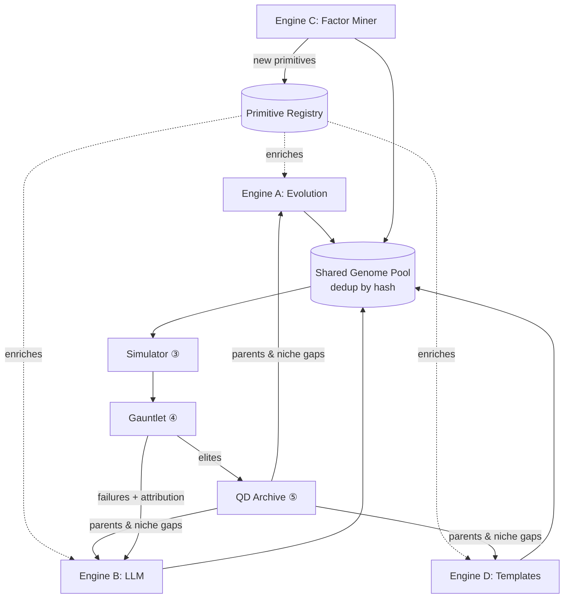

# 03 — Generation Engines

> Requirement ①: *"conceptualize dozens of concurrent trading strategies."* Four engines feed one population. Diversity of *sources* is a defense against any single engine's blind spots.

## 1. Why four engines, not one

Each generator has a characteristic failure mode. Running them together, into a shared genome pool, means one engine's weakness is covered by another's strength:

| Engine | Strength | Failure mode alone | Antidote |
|---|---|---|---|
| Evolutionary/GP | Ruthless local optimization, structural search | Converges to overfit spikes; low semantic insight | QD niching + LLM novelty |
| LLM proposer/critic | Semantic hypotheses, reads failures, transfers ideas | Plausible-but-wrong; anchors on narratives | Gauntlet rejects; evolution stress-tests |
| Factor miner | Finds raw predictive expressions data-first | Data-mined ghosts; no economic story | DSR trial accounting; LLM demands a *why* |
| Template sampler | Cheap diversity, seeds empty niches | Naive; rarely elite | Feeds evolution raw material |

## 2. Engine A — Evolutionary / Genetic Programming

**Substrate:** the genome graph ([02](02_STRATEGY_GENOME_DSL.md)). **Method:** population-based search with `mutate` and `crossover`, selected by the multi-objective fitness from [06](06_SELF_IMPROVEMENT_LOOP.md).

- **Mutation:** perturb one arg (window 14→21), swap one op (RSI→ADX), add/remove a signal term, flip a meta gene (regime filter, timeframe). Bounded by the DSL's arg ranges.
- **Crossover:** exchange typed subtrees between parents — e.g. genome-1's *signal* married to genome-2's *risk overlay*. Type-checking keeps offspring valid.
- **Selection:** **NSGA-II** on the Pareto front of (return, robustness, orthogonality, capacity, simplicity). Not single-objective — single-objective GP is an overfitting machine.
- **Speciation / islands:** run several sub-populations (islands) with occasional migration, and constrain them by behavioral niche (MAP-Elites). This is the exact recipe the 2025–2026 literature (QuantEvolve, MadEvolve, CodeEvolve) converged on for keeping evolutionary search *diverse* instead of collapsing onto one peak.
- **Free tooling:** `deap` or `gplearn` for the GP mechanics; a thin adapter maps them onto the genome registry. Symbolic-regression alpha mining (`gplearn`) plugs directly into Engine C.

## 3. Engine B — LLM Proposer + Critic (the "self-reflection" engine)

This is the piece that makes the system feel like it *thinks*. Two roles, same model, adversarial to each other.

### Proposer
Given: the current archive summary, recent market observations (regime, what's working), the **Lesson Library**, and a menu of DSL primitives, the LLM emits new genomes via `from_prose`. It reasons in economic language — "funding is extremely positive and crowded on alts while BTC vol is compressing; propose a mean-reversion short-funding-carry genome gated on a liquidity sweep" — then compiles that hypothesis into a typed genome.

### Critic
Given a *finished backtest* (equity curve, trade ledger, regime-sliced P&L, feature attribution/SHAP from your `SMC_ML` diagnostics), the LLM writes a structured **post-mortem**: *why* did this win or lose, *when* did it break, *what single change* might fix it, and *what general lesson* should be remembered. That lesson is appended to the Lesson Library and conditions all future proposals. This is the **Reflexion / Voyager pattern** — accumulating a growing skill/lesson memory — applied to trading. See [06](06_SELF_IMPROVEMENT_LOOP.md) for the loop mechanics.

### Cost = $0
The critic runs on a free-tier LLM (your sentiment scanners already use free LLM calls), or a local open-weights model (Llama/Qwen/DeepSeek via `ollama`) for unlimited offline critique. Batches run in the inner loop; nothing is time-critical.

### Guardrail
The LLM **never sees live capital and never bypasses the gauntlet.** Its proposals are hypotheses, not decisions. A beautifully-argued genome that fails PBO is killed exactly as fast as a random one. The LLM's job is to raise the *hit rate* of the generator and to *explain* results — not to be trusted.

## 4. Engine C — Factor Miner (data-first)

Searches the space of **symbolic feature expressions** for raw predictive power against forward returns, measured by **Information Coefficient** — which you already compute in `xsec/ic_report.py` and `xsec/smc_ic_audit.py`. Methods: `gplearn` symbolic regression, plus your existing z-scored factor blend as a strong baseline. Any expression clearing an IC/IR threshold *and* surviving neutralization (`xsec/neutralize.py`, BTC-beta residualization) becomes a **feature primitive** the other engines can wire into full genomes.

**Discipline:** the miner is the most overfitting-prone engine (it searches expressions directly against returns). So (a) every mined factor is charged to the trial count for Deflated Sharpe, and (b) the LLM critic must be able to assign it a plausible economic rationale, or it is flagged "no-story" and quarantined for extra OOS scrutiny.

## 5. Engine D — Template Sampler (diversity seeder)

A deliberately broad library of parameterized strategy *archetypes* — trend-follow, mean-revert, breakout, momentum, cross-sectional momentum, carry/funding-carry, volatility-targeting, pairs/statistical-arbitrage, seasonality, liquidity-sweep-reversal (the SMC family), intermarket/lead-lag, and — importantly — **fully random genomes** that wire arbitrary primitives together with no archetype at all. Each is a genome template with free parameters. The random-genome stream matters as much as the named archetypes: it is how the system discovers structure it was never told to look for, satisfying "interlinked in ways we can't imagine." The sampler fills empty behavioral niches ([02 §6](02_STRATEGY_GENOME_DSL.md)) with fresh draws. Cheap, dumb, and essential: it keeps the population from inbreeding, prevents the search from collapsing onto any one school of thought, and gives evolution raw genetic material.

## 6. How the engines share one population

- **One pool, deduplicated by genome hash.** If two engines independently propose the same idea, it is backtested once and both get credit. The Result Ledger ([01 §5](01_SYSTEM_ARCHITECTURE.md)) guarantees no double-counting corrupts the trial statistics.
- **A compute budget is split across engines by a bandit** (a small meta-controller, [06](06_SELF_IMPROVEMENT_LOOP.md)) that shifts generation budget toward whichever engine is currently producing the most *archive-improving* genomes — so the system learns *how to generate*, not just what to trade.
- **Novelty pressure:** all engines are biased toward genomes predicted to occupy *empty* niches, directly satisfying "dozens of concurrent, *different* strategies."

## 7. Throughput target

Local CPU + burst on free GitHub Actions runners ([08](08_INFRASTRUCTURE_AND_DATA.md)) should sustain **hundreds of genomes screened and dozens fully validated per day**, comfortably exceeding the "dozens of concurrent strategies" requirement. The bottleneck is never generation (cheap) — it is honest validation ([05](05_VALIDATION_GAUNTLET.md)), which is exactly where the compute *should* be spent.
