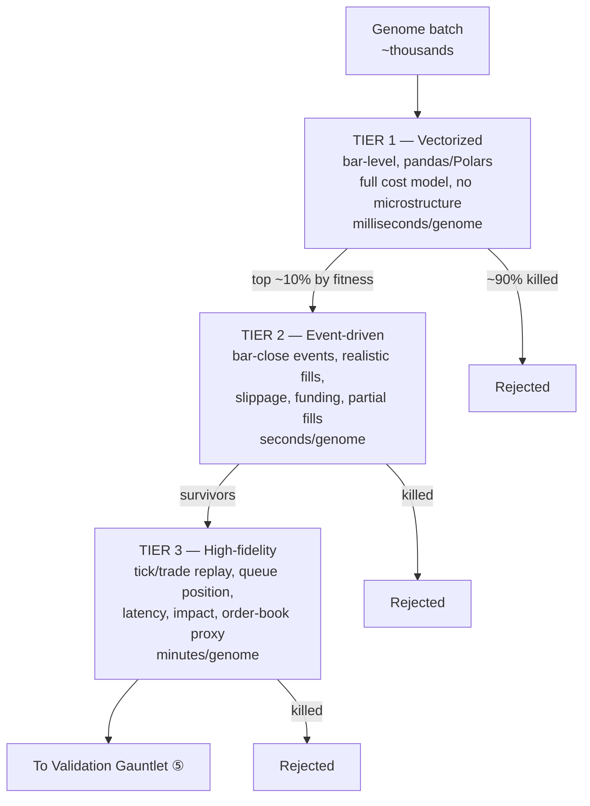
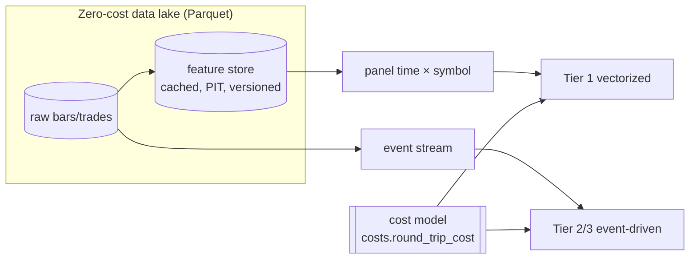

# 04 — The Backtest Simulator

> Requirement ②: *"an internal simulation engine that instantly backtests newly generated strategies against historical tick and volume data."* The trick to "instant" *and* "realistic" is **multi-fidelity**: cheap sims to rank, expensive sims to trust.

## 1. The fidelity ladder

You cannot run a tick-level, microstructure-accurate simulation on ten thousand candidates — and you must not promote a strategy to capital on a coarse one. So candidates climb a ladder, and most die on the cheap rungs. This is **successive halving / Hyperband applied to backtest fidelity**: spend little compute to eliminate the many, spend heavy compute to confirm the few.



| Tier | Data granularity | Realism | Speed | Purpose |
|---|---|---|---|---|
| **1 Vectorized** | 1m–4h bars | Costs + funding, no queue | ~ms | Rank thousands; kill the obvious losers |
| **2 Event-driven** | Bar-close events | Slippage, partial fills, latency stub | ~sec | Confirm ranking survives realistic execution |
| **3 High-fidelity** | Tick / aggTrades | Queue position, impact, book proxy | ~min | Final proof for capital-bound candidates |

**Tier 1 reuses your `backtest/engine.py`** almost verbatim — the vectorized, cost-aware, cross-sectional backtester you already built. Tiers 2–3 are new event-driven engines that share the *same* feature store and cost model so results are comparable across rungs.

## 2. The data substrate (what makes it fast)

Speed comes from *never recomputing what you can cache* and from columnar storage:

- **Raw layer:** historical bars, trades, and aggTrades stored as **partitioned Parquet** (by symbol/date). Binance publishes these as free bulk daily/monthly dumps (`github.com/binance/binance-public-data`); OANDA candles via the free v20 practice API. See [08](08_INFRASTRUCTURE_AND_DATA.md).
- **Feature store:** every feature primitive is computed once per (symbol, timeframe, param) and cached, point-in-time. Genomes reference cached feature columns; a new genome that reuses `atr_pct(14)` pays zero to recompute it. This is the single biggest speed lever — most genomes are recombinations of a shared, finite feature vocabulary.
- **Query engine:** **DuckDB / Polars** over Parquet gives columnar, multi-core, out-of-core scans with no server and no license. Memory-mapped access means datasets larger than RAM still stream fast.
- **Panel abstraction:** your existing `xsec/panel.py` `[time × symbol]` matrix is the in-memory working form; Tier 1 operates on it directly.



## 3. Realistic execution modeling (where paper-profits go to die honestly)

The gap between a naive backtest and reality is almost entirely execution. Each tier charges progressively more of it:

- **Fees:** maker/taker per venue (Binance perp/spot; OANDA spread-as-fee). From your `backtest/costs.py`.
- **Spread & slippage:** half-spread on entry/exit; slippage scaled by order size vs. bar volume.
- **Funding:** perp funding accrued on held positions (you already track `funding_rate`).
- **Market impact (Tier 3):** a square-root-law impact model (impact ∝ √(size/ADV)); crucial for the **capacity** test in [05](05_VALIDATION_GAUNTLET.md).
- **Latency & queue (Tier 3):** simulate the delay between signal and fill and (for limit orders) queue position, using replayed trade prints as the fill oracle.
- **Partial fills & rejects:** large or illiquid orders don't fully fill at the quoted price.

**Rule:** a strategy's fitness is always its **net, post-cost** return. A genome that is profitable gross and unprofitable net is a *loser*, full stop — and most naive "great backtests" are exactly this.

## 4. Correctness guarantees (anti-leakage, by construction)

These are non-negotiable and mostly inherited from your existing discipline:

1. **Closed-bar only.** Signals compute on completed candles (`n = len(df) - 1`), never the live/forming bar. A DSL invariant ([02](02_STRATEGY_GENOME_DSL.md)).
2. **Point-in-time features.** No feature may use data timestamped after the decision bar. The feature store enforces this; snapshots are content-addressed.
3. **Purge & embargo** on any train/test split (your `backtest/purged_cv.py`): a rebalance at bar *p* realizes over `[p, p+horizon]`, so train bars whose forward window reaches the test fold are dropped. This is enforced in the *simulator*, not just the validator, so even a single walk-forward run is leak-free.
4. **Survivorship-safe universe.** The universe includes symbols that were later delisted, reconstructed at each point in time. (Your `Past_Trading` delisting work feeds this.)
5. **Deterministic & seeded.** Every run records its data-snapshot id and RNG seed in the Result Ledger; results are byte-reproducible.

## 5. The evaluation contract (simulator → gauntlet)

Every backtest emits a standard **EvalResult** object, so the gauntlet and archive treat all genomes uniformly regardless of which engine produced them:

```yaml
eval_result:
  genome_id: "a3f8...c1"
  fidelity: "tier2"
  data_snapshot: "binance_2019-2026_v3"     # for reproducibility
  seed: 4242
  net_returns: <series>                      # per-rebalance, post-cost
  trade_ledger: <table>                       # entries, exits, P&L, MFE/MAE, regime tag
  turnover: <series>
  behavioral_descriptor: [hold, exposure, skew, turnover, regime, tilt]  # for QD niching
  summary:
    sharpe_net: ...
    max_dd: ...
    trades: ...
    hit_rate: ...
    capacity_usd: ...
```

The `net_returns` series flows straight into your `analysis/smc_monte_carlo.py` (stationary bootstrap) and the DSR tooling — you already wired "book + selector return series flow into smc_monte_carlo." Master Trader simply makes *every* genome speak this contract.

## 6. Throughput engineering (the "high-speed" in the requirement)

- **Vectorize Tier 1** across the whole panel at once (NumPy/Polars), not symbol-by-symbol loops.
- **Cache aggressively:** shared feature store + memoized sub-expressions; dedup genomes by hash before simulating.
- **Parallelize embarrassingly:** genomes are independent — fan them across local cores and free GitHub Actions runners (each PR/cron job = a free parallel worker). Store results back to the ledger.
- **Multi-fidelity gating** means ~90% of compute-hungry candidates are eliminated at Tier 1 for near-zero cost.
- **Optional acceleration:** `numba`/`polars` for hot loops; free Kaggle/Colab GPU only if you later add deep sequence models — pure backtesting stays CPU-bound and free.

Net effect: the *generation* side can propose dozens per hour, and the simulator can honestly keep up, spending its heaviest compute only on the handful of genomes that have already earned it.
