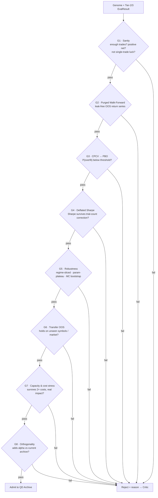

# 05 — The Validation Gauntlet

> The most important document in this repository. Every other subsystem *produces* candidate strategies; this one exists to *destroy* them. What survives is not "good" — it is "not yet disproven." That linguistic discipline is the whole game.

## 1. Why this is where the edge actually lives

If you generate thousands of strategies and keep the best backtest, you have not found alpha — you have found the luckiest coin flip in a very large tournament. The best backtest out of 1,000 random strategies will look *spectacular* by pure chance. **The gauntlet's job is to estimate how much of a strategy's performance is skill vs. selection luck, and reject anything that cannot clear that bar after correcting for the number of things you tried.**

This is the single discipline that separates a research desk from a gambler, and it is where you already have a head start (`backtest/purged_cv.py`, `analysis/smc_monte_carlo.py`, DSR tooling). Master Trader industrializes it: *no genome enters the archive without a full gauntlet report.*

## 2. The gauntlet, gate by gate

A candidate must pass **all** gates in sequence. Any failure → rejected, with a machine-readable reason that feeds the LLM critic ([06](06_SELF_IMPROVEMENT_LOOP.md)). No gate compensates for another — this is your proven 5-gate no-compensation philosophy, applied to validation.



### G1 — Sanity
Minimum trade count (small samples lie), positive net expectancy, no single trade contributing >X% of P&L, no degenerate all-in-one-bar behavior. Cheap; kills the obviously broken.

### G2 — Purged Walk-Forward CV
Expanding-window out-of-sample with **purge + embargo** (your `purged_cv.py`). Produces an honest OOS return series. A strategy that only shines in-sample dies here.

### G3 — Combinatorial Purged CV → Probability of Backtest Overfitting (PBO)
The core anti-overfitting test (Bailey & López de Prado). **CPCV** generates *many* train/test path combinations rather than one, yielding a *distribution* of OOS performance. From the rank of the in-sample-best configuration across its OOS paths, compute **PBO = P(the in-sample-optimal strategy underperforms the median out-of-sample).** A high PBO means the strategy's selection was likely luck. **Reject if PBO > ~0.5** (tunable; stricter is safer). CPCV has been shown to dominate k-fold and single walk-forward for exactly this purpose.

### G4 — Deflated Sharpe Ratio (DSR)
The Sharpe ratio, *corrected for the number of trials, non-normal returns (skew/kurtosis), and sample length* (Bailey & López de Prado). This is the multiple-testing firewall: it directly answers "given that I tried N genomes, is this Sharpe still significant?" **The trial count N comes from the Result Ledger** ([01 §5](01_SYSTEM_ARCHITECTURE.md)) — it literally counts how many genomes were evaluated in the family. **Reject if DSR is not significant** (e.g. PSR-style p < 0.05 after deflation). *This gate is why the ledger's honest trial accounting is sacred: under-count N and you fool yourself; over-count and you reject real alpha.*

### G5 — Robustness triad
- **Regime slicing:** performance decomposed by regime (bull/bear/chop × low/high vol), reusing `xsec/regime.py` and your `bearish_regime_analysis.py`. A strategy that only works in one never-to-repeat regime is fragile.
- **Parameter plateau:** perturb every arg ±1 step and re-score. A real edge is a *plateau* (neighbors also work); an overfit spike collapses when nudged. Reusing your `tuning_guide.md` sensitivity ethos.
- **Monte Carlo:** stationary-block bootstrap of the return series (your `analysis/smc_monte_carlo.py`) → distribution of Sharpe/max-DD, not a point estimate. Reject if the 5th-percentile outcome is unacceptable.

### G6 — Transfer / true out-of-sample
The hardest, most honest test: does the edge hold on data the search *never touched*? Options, in increasing strictness: unseen symbols (train BTC-universe, test on a held-out symbol set), an unseen *time* holdout locked away from all search, and cross-market transfer (a crypto factor tested on FX/XAU). A genome that transfers is far more likely to be real than one that doesn't.

### G7 — Capacity & cost stress
Re-run Tier 3 with the square-root impact model and **2× the assumed costs.** If the edge evaporates under realistic size or slightly higher friction, it was never tradeable. Also record `capacity_usd` — the size at which impact eats the edge.

### G8 — Orthogonality / marginal contribution
Even a genuinely good strategy is worthless if it duplicates one already in the archive. Compute return correlation and factor overlap vs. current archive members; admit only if it **adds** risk-adjusted return to the *portfolio* (marginal Sharpe contribution > threshold). This is what turns "many strategies" into "a diversified book."

## 3. The trial-count ledger (the honesty backbone)

Every gate above is only as honest as the trial count feeding G4. The **Result Ledger** records *every* genome evaluated — including the ones the generators discarded quietly — because each one is a "try" that inflates the best result.

**This is exactly what licenses the expansive, "test everything" philosophy** ([README principle 3](../README.md)). You are free to throw an unbounded, agnostic universe of indicators and interlinked combinations at the wall — SMC, TA, statistics, cross-asset, random — *precisely because* the ledger counts every throw and the Deflated Sharpe deflates for it. Breadth is not the enemy of rigor; it is the input rigor is built to handle. The more you test, the more this machinery matters, and the more valuable it becomes. Practically:

- The DSR's effective-number-of-trials uses the ledger's family size, optionally shrunk by the *correlation* among trials (highly similar genomes count as fewer independent trials — the "effective N").
- White's **Reality Check** / Hansen's **SPA test** can be run at the *population* level periodically: is the *best* strategy in the whole archive better than a data-snooping null? A sober periodic audit of the entire enterprise.

**If you cheat here — by not counting failed trials — every downstream number is a fantasy.** This is stated bluntly because it is the most common, most fatal, and most *tempting* error in the field.

## 4. Fitness = what evolution optimizes (multi-objective)

The gauntlet also defines the **fitness vector** returned to the Self-Improvement loop. It is deliberately *not* a single number, to avoid Goodhart's law:

```
fitness = (
  deflated_sharpe,          # skill after trial correction  (maximize)
  1 - PBO,                  # robustness to overfitting      (maximize)
  regime_breadth,           # # of regimes it survives       (maximize)
  capacity_usd,             # tradeable size                 (maximize)
  -complexity,              # Occam penalty                  (minimize nodes)
  -archive_correlation,     # orthogonality to the stable    (minimize)
)
```

Evolution ([03](03_GENERATION_ENGINES.md)) runs **NSGA-II on this Pareto front**, and the QD archive niches by behavioral descriptor. Together these guarantee the system never collapses onto a single over-optimized point — it maintains a *frontier* of trade-offs.

## 5. Failure is data — the reject path

A rejected genome is not deleted; its **rejection reason** (which gate, which statistic, which regime it broke in, feature attribution) is written to the Result Ledger and handed to the LLM critic. Patterns across many rejections become **lessons** ("funding-carry longs die in vol-expansion regimes") that steer future generation. The gauntlet is thus not just a filter but the richest *teaching signal* in the system — see [06](06_SELF_IMPROVEMENT_LOOP.md).

## 6. What "passing" earns you (and what it doesn't)

Passing the gauntlet earns a genome **admission to the archive and eligibility for paper trading** — nothing more. It does *not* earn live capital; that requires surviving a live paper-incubation that confirms the backtest was not fiction ([07](07_LIVE_ADAPTATION_AND_PORTFOLIO.md)). The gauntlet controls *statistical* self-deception; only live-forward testing controls *structural* self-deception (a data bug, a look-ahead you didn't catch, a regime that just ended). Both firewalls are required.
