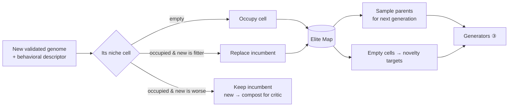
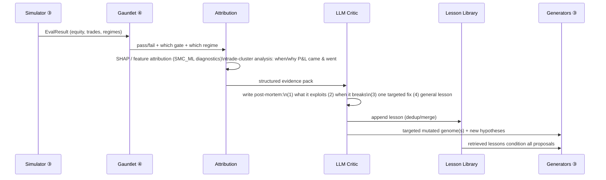

# 06 — The Self-Improvement Loop

> Requirement ③: *"a mechanism (RL, evolutionary algorithms, or LLM-driven critique) where the system analyzes why a strategy failed or succeeded, tweaks parameters or logic, and re-tests iteratively."*
>
> The answer is **not to choose** among RL / EA / LLM. It is to use **all three, each at the layer where it is genuinely best**, coordinated by a quality-diversity archive. Choosing one would be leaving most of the improvement on the table.

## 1. Division of labor

| Mechanism | Operates on | Improves | Why it's the right tool *here* |
|---|---|---|---|
| **Evolutionary (NSGA-II + MAP-Elites)** | Genome structure & params | The *strategies themselves* | Search over a discrete/graph space; no gradients; naturally maintains a diverse population |
| **LLM critic (Reflexion/Voyager)** | Trade-level results & failures | The *hypotheses & lessons* | Semantic reasoning about *why*; transfers insight across strategies; writes durable, human-readable lessons |
| **Bandit / RL meta-controller** | Resource & capital allocation | *Where to spend search & risk* | Sequential decisions under uncertainty with delayed reward — the textbook bandit/RL setting |

A common mistake is to reach for deep RL to *trade directly*. Don't — it is sample-inefficient, unstable, and overfits historical paths notoriously. RL earns its place in **allocation and execution timing**, not in raw signal generation. Evolution and the LLM own strategy discovery; the bandit owns "where to point the effort."

## 2. The MAP-Elites archive (quality-*diversity*, not just quality)

The archive is a **grid of behavioral niches** ([02 §6](02_STRATEGY_GENOME_DSL.md)). Each cell holds the single best (by fitness) genome whose behavior falls in that cell. Axes are behavioral, e.g.:

```
axis 1: median holding period   [scalp | intraday | swing | position]
axis 2: dominant regime         [trend | range | high-vol | low-vol]
axis 3: net exposure style      [directional | market-neutral | carry]
```



**Why this matters more than a leaderboard:** a top-N leaderboard converges on fifty near-identical variants of one overfit idea. MAP-Elites *forces* coverage of the behavioral space, so you end up with a genuinely diverse stable — the "dozens of concurrent strategies" requirement satisfied *by design*, and a portfolio that is robust because its members fail at different times. This is the core mechanism behind the 2025–2026 QuantEvolve / MadEvolve / CodeEvolve results.

## 3. The reflection cycle (the "why did it win or lose" engine)

This is the loop that makes the system introspective rather than merely evolutionary.



- **Attribution first, opinion second.** Before the LLM says anything, the system computes hard evidence: SHAP feature importances (from your `SMC_ML` diagnostics), regime-sliced P&L, and trade clustering (which *kinds* of trades made/lost money). The LLM reasons over *evidence*, not vibes.
- **Structured post-mortem.** A fixed schema: `exploits`, `breaks_when`, `single_fix`, `general_lesson`, `confidence`. Structure keeps the critique actionable and machine-consumable.
- **Lesson Library = compounding memory.** Lessons are deduplicated, merged, and retrieved (embedding search) to condition future proposals. Over months this becomes a written body of *your* market wisdom that the generator can't forget — the Reflexion/Voyager "skill library," specialized to trading.
- **Targeted re-test.** The critic's "single fix" becomes a concrete mutation that is *immediately re-simulated and re-validated*, closing the analyze→tweak→re-test loop the requirement asks for.

## 4. The bandit meta-controller (learning where to dig)

A lightweight contextual bandit (Thompson sampling / EXP3) sits above the whole discovery loop and allocates two scarce budgets:

1. **Generation budget across engines** ([03](03_GENERATION_ENGINES.md)): reward = archive-improving genomes produced per compute-hour. If the LLM engine is on a hot streak, it gets more budget this week; if the factor miner is producing only ghosts, it gets less. **The system learns *how* to generate, not just what to trade.**
2. **Search budget across niches**: reward = fitness improvement per evaluation in a region. Under-explored but promising niches get more sims.

This is the appropriate, sample-efficient use of the RL family: sequential allocation under uncertainty with delayed, noisy reward. (The *capital* allocator in [07](07_LIVE_ADAPTATION_AND_PORTFOLIO.md) is the same math pointed at live risk budget.)

## 5. Optional: PPO for a single, well-understood problem

Your `SMC_ML/ML_SYSTEM_DESIGN.md` already scopes a Phase-4 **PPO agent for position sizing / entry timing** on top of a *fixed, validated* signal. That is the *correct* niche for deep RL: a narrow, well-posed control problem (given this validated edge, when exactly do I enter and how big?), not open-ended alpha discovery. Master Trader keeps this as an *execution-layer* research track, gated behind having thousands of exploration samples and never allowed to invent signals from scratch. Treat it as a refinement, not a foundation.

## 6. Anti-Goodhart safeguards

Self-improving systems are dangerous precisely because they optimize whatever you measure. Guards, all already implied by the gauntlet:

- **Optimize a multi-objective Pareto front, never a single scalar** ([05 §4](05_VALIDATION_GAUNTLET.md)).
- **Trial count is charged for every mutation** — the loop cannot "iterate its way" to significance without the DSR deflating it.
- **Quality-diversity resists mode collapse** — the archive rewards *difference*, penalizing fifty clones of the current champion.
- **A locked holdout** ([05 G6](05_VALIDATION_GAUNTLET.md)) the loop is *never* allowed to see is the final referee; if archive performance and holdout performance diverge, the loop is overfitting and search parameters are tightened.
- **The LLM critic is adversarial by role** — its prompt is to *find the reason this will fail live*, not to celebrate the backtest.

## 7. What one full iteration looks like

1. Generators emit a batch (evolution mutates archive elites; LLM proposes from lessons; miner mints factors; templates fill gaps).
2. Simulator screens Tier 1 → 2 → 3.
3. Gauntlet tries to disprove survivors; emits fitness + rejection reasons.
4. Survivors update the MAP-Elites archive (occupy/replace niches).
5. Attribution + LLM critic write post-mortems → Lesson Library; propose targeted fixes.
6. Bandit reallocates next batch's generation/search budget by observed payoff.
7. Repeat — continuously, unattended, on free compute.

Every loop the archive gets *more diverse and more robust*, the lesson library gets *wiser*, and the generators get *better-aimed*. That compounding — not any single strategy — is the asset.
