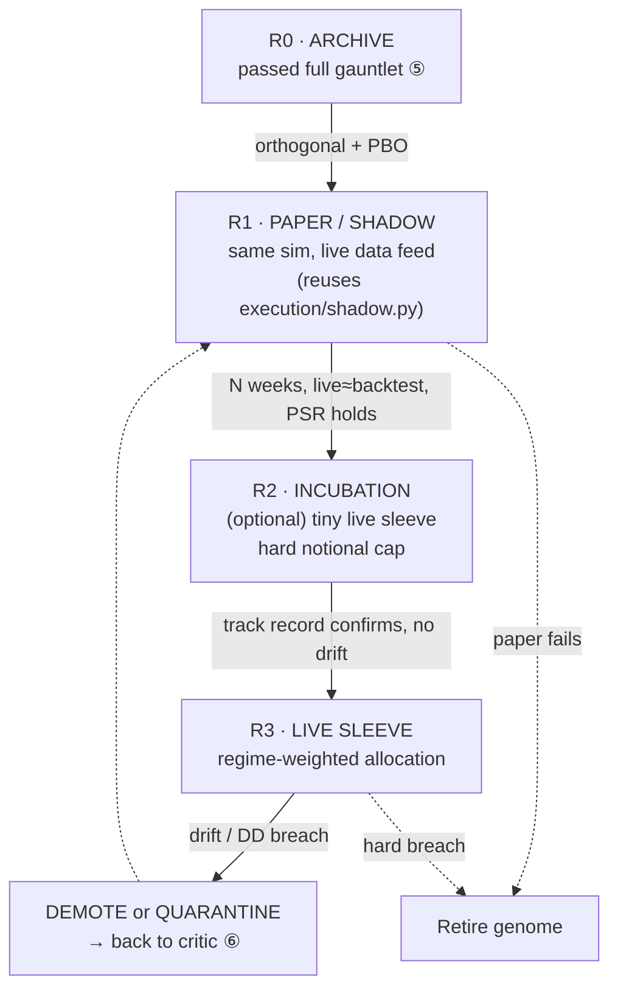
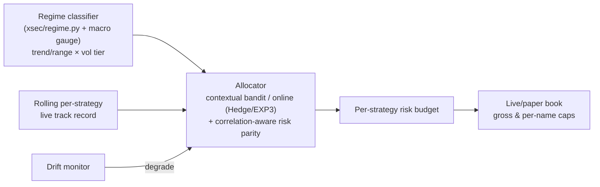
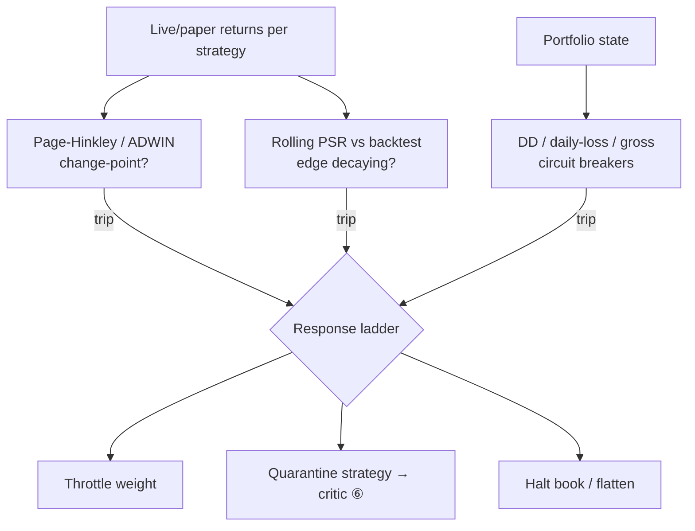

# 07 — Live Adaptation & Portfolio

> Requirement ④: *"how this model transitions from testing to paper trading, dynamically adapting to changing market conditions."* This is where discipline matters most, because it is where mistakes cost money instead of compute.

## 1. The promotion ladder (nothing skips a rung)

A strategy earns exposure one rung at a time. Each rung has explicit entry criteria and an automatic demotion trigger. Capital only ever flows *up* rungs it has earned, and drops instantly on breach.

| Rung | Capital | Gate to enter | Auto-demote when |
|---|---|---|---|
| R0 Archive | none | Full gauntlet passed | never (dormant) |
| R1 Paper/Shadow | none (simulated) | Orthogonal, PBO/DSR ok | paper Sharpe << backtest, or logic error |
| R2 Incubation | tiny, capped | ≥ N weeks paper ≈ backtest | any drift signal |
| R3 Live sleeve | risk-budgeted | Incubation track record clean | drawdown or drift breach |

**This deliverable formally stops at R1 (paper/shadow).** R2/R3 involve real capital and are *your* business decision, not the machine's — the system will *recommend* promotions but must never self-authorize a live-capital action (a hard rule; see §6).

## 2. Paper/shadow trading — the reality check that catches what statistics can't

The gauntlet ([05](05_VALIDATION_GAUNTLET.md)) controls *statistical* self-deception. Paper trading controls *structural* self-deception — the look-ahead bug you didn't catch, the data revision, the regime that just ended, the fill you'd never actually get. It is run through the **exact same event-driven simulator** ([04](04_BACKTEST_SIMULATOR.md)) as the backtest, only fed a live data stream instead of history. This is your existing `execution/shadow.py` pattern, generalized to every archive strategy.

The key comparison is **live-paper vs. backtest-expected**: if a strategy's live paper returns, hit rate, and turnover track its backtest distribution, the backtest was probably honest. If they diverge immediately, the backtest was fiction — and you've learned that for *free*, before risking a cent.

## 3. The regime-aware allocator (dynamic adaptation)

The portfolio of live/paper strategies is not equally weighted and not static. A meta-allocator distributes the risk budget *conditional on the current regime*, because a strategy's edge is regime-dependent — the whole reason MAP-Elites niches by regime.

- **Regime conditioning:** the allocator up-weights strategies whose niche matches the *current* regime and down-weights the rest. A trend strategy gets budget in trending vol; a mean-reverter gets it in chop. Regime from your `xsec/regime.py` plus the `Macro_Compass` risk-on/off gauge.
- **Online weighting:** a Hedge/EXP3-style online allocator (or Thompson sampling over strategies) shifts weight toward what is *currently* working without over-reacting to noise. Same bandit math as the [06](06_SELF_IMPROVEMENT_LOOP.md) meta-controller, pointed at risk instead of search.
- **Correlation-aware sizing:** risk-parity / min-correlation weighting on top, so the book stays diversified even as individual weights move. Reuses `xsec/portfolio.py`.
- **Turnover damping:** weight changes are throttled and cost-charged, so the allocator doesn't churn the book chasing noise.

## 4. Concept-drift detection & kill switches (the immune response)

Markets are non-stationary; every edge decays. The system must *notice decay and act* rather than ride a dead strategy down. Three layers, fastest to slowest:

1. **Statistical drift on the live return stream:** Page-Hinkley test / ADWIN / CUSUM on each strategy's rolling P&L to flag a change-point. Cheap, fast, per-strategy.
2. **Live-vs-backtest divergence:** rolling **Probabilistic Sharpe Ratio** of live returns vs. the backtest's expected Sharpe. If live PSR falls below threshold, the edge is degrading. This is the single most informative live monitor because it's grounded in the strategy's *own* validated expectation.
3. **Portfolio circuit breakers:** hard global limits — max drawdown, max daily loss, gross exposure caps, correlation spikes — that cut risk regardless of any single strategy's opinion. Reuses your adaptive-risk and cost-filter machinery (`trading/smc_cost_filter.py`, `smc_trade.py`).

**Graduated response, not binary:** a mild drift throttles a strategy's weight; a strong drift quarantines it (and ships its telemetry to the LLM critic as a fresh lesson); a portfolio-level breach flattens the book. Quarantined strategies re-enter at R1, not R3 — they must re-earn trust.

## 5. Closing the outer loop back to research

Every live event is a teaching signal. A strategy that decays live becomes a **cautionary genome** in the Lesson Library: *what regime killed it, how fast, what the leading indicator of decay was.* The generators then learn to build strategies with *earlier* decay-warning properties or better regime filters. Live trading is thus not the end of the pipeline — it's the highest-quality data source feeding the front of it.

## 6. Governance — the non-negotiables for real money

- **No autonomous live-capital action, ever.** The machine recommends R2/R3 promotions; a human authorizes them. Financial actions (placing orders, moving funds) stay with you by design — the system's outputs are signals, sizes, and alerts (via your existing Telegram delivery), not broker executions, unless *you* explicitly wire and authorize that separately.
- **Global kill switch** reachable by you at any time, independent of the allocator.
- **Every live order intent is logged, attributable, and reproducible** to the genome + data snapshot that produced it.
- **Start absurdly small.** When/if you go live, incubate at a size where total loss is irrelevant to you. The point of R2 is information, not income.
- **Costs and taxes are real.** Paper Sharpe is an upper bound; live will be worse. Budget for that gap emotionally and financially before it arrives.

## 7. What "adapting to changing market conditions" concretely means here

Three adaptation timescales, each handled by a named mechanism — so "adaptive" is an engineered property, not a hope:

| Timescale | Mechanism | Doc |
|---|---|---|
| Intraday–days | Regime-aware allocator reweights the existing book | §3 |
| Days–weeks | Drift detection retires decayed strategies, promotes fresh ones from the archive | §4 |
| Weeks–months | Discovery loop breeds *new* strategies for the *new* regime; lessons update generation | [06](06_SELF_IMPROVEMENT_LOOP.md) |

The portfolio you run in six months should share few members with today's — not because anything broke, but because the machine kept finding fresher edges and retiring stale ones. That continuous turnover *is* the adaptation.
