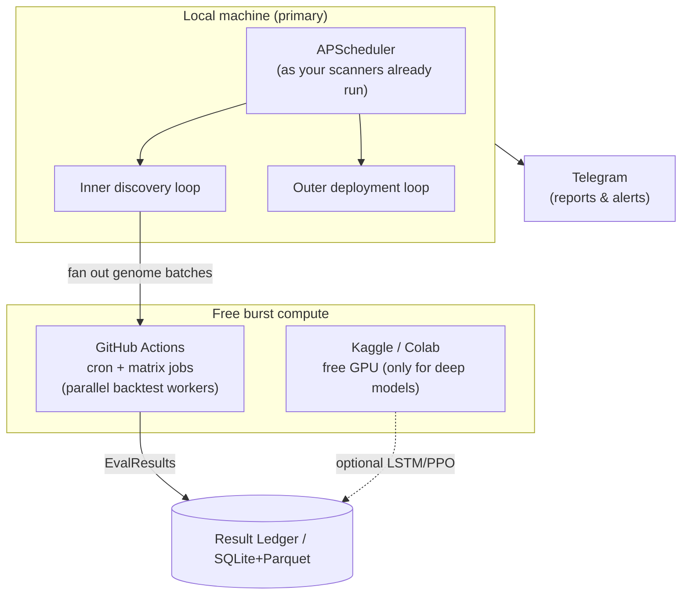

# 08 — Infrastructure & Data (Zero-Cost Stack)

> Hard constraint: **$0.** Every component here has a free tier sufficient for this scale. Where a "free" source has a catch (rate limits, deprecation, survivorship), it's flagged. Free doesn't mean careless — it means engineered around the limits.

## 1. Data sources

| Domain | Source | What you get | Cost | Catch / note |
|---|---|---|---|---|
| **Crypto bars/trades/aggTrades** | **Binance public data dumps** (`github.com/binance/binance-public-data`) | Bulk daily & monthly klines, trades, aggTrades — the tick/volume history the requirement needs | Free bulk download | The gold source for backtest history; download once, store as Parquet |
| Crypto live/recent | Binance REST **v3** + WebSocket | Recent klines (≤1000/call, 2400 wt/min), live order flow, funding | Free | ⚠️ v1 klines/aggTrades REST **retire 2026-03-25** — use v3 endpoints |
| Crypto multi-venue | **CCXT** (already in your `requirements.txt`) | Unified access to Binance/MEXC/Bybit; venue failover | Free (lib) | You already use this — MEXC primary, Binance/Bybit fallback |
| **FX + XAU** | **OANDA v20 REST**, practice account | Historical candles + live pricing for FX majors and **XAUUSD**; free paper trading | Free (practice) | Rate-limited; practice rates differ slightly from live — fine for research |
| Macro | **FRED** (St. Louis Fed) | Rates, macro series for regime/risk gauges; **CME-FedWatch-style Fed policy expectation** (1Y yield − FOMC target → `fed_expectation`, PIT-lagged to the next-day H.15 release) via `mt.ingest.fedwatch` | Free API key (`FRED_API_KEY`, borrowed from the sibling stacks) | Already used by `Macro_Compass`. CME publishes no free FedWatch/ZQ API, so we reproduce the same signal from FRED |
| Positioning | **CFTC COT** (Socrata) | Weekly futures positioning (upgrade to TFF report per your FX-scanner backlog) | Free | Weekly cadence; lag-aware |
| News/sentiment | **GDELT** + **Finnhub** (free tier) | News flow, event sentiment | Free tier | Already wired in FX/XAU sentiment scanners; add retry/backoff (your backlog) |

**Data hygiene (non-negotiable):**
- **Survivorship:** include delisted symbols. Your `Past_Trading` delisting-probability work + Binance's historical dumps make a point-in-time-correct universe achievable. Testing only on survivors silently inflates every result.
- **Point-in-time snapshots:** each dataset version is content-addressed (`binance_2019-2026_v3`) and referenced in every EvalResult, so any backtest is reproducible.
- **One download, many reads:** pull raw history once into Parquet; never hammer live APIs for backtests (respects rate limits and keeps you off the "abuse" radar).

## 2. Storage

| Layer | Tech | Why (and why free) |
|---|---|---|
| Raw & feature lake | **Parquet**, partitioned by symbol/date | Columnar, compressed, splittable; free; plays with everything |
| Query / compute | **DuckDB** + **Polars** | In-process OLAP over Parquet, multi-core, out-of-core; no server, no license |
| Panel working set | pandas / NumPy (`xsec/panel.py`) | Your existing `[time × symbol]` matrices |
| Registries & ledgers | **SQLite** (WAL mode) | Genome registry, Result Ledger, Lesson Library; you already run SQLite (`smc_signals.db`) |
| Model artifacts | Local files + `joblib`/`pickle` | LightGBM models etc., as `SMC_ML/models/` already does |

No database server, no cloud warehouse, no paid vector DB (embeddings for the Lesson Library fit in SQLite + `faiss`/`sqlite-vss`, both free).

## 3. Compute & orchestration



- **Local first.** Backtesting is CPU-bound and embarrassingly parallel; a normal multi-core machine sustains the throughput target ([04 §6](04_BACKTEST_SIMULATOR.md)).
- **GitHub Actions as a free compute grid.** You already deploy scanners via GitHub Actions. A matrix job = many parallel free runners; each runs a genome batch and writes EvalResults back. Respect the monthly free-minute allotment by reserving Actions for burst validation, not continuous screening.
- **Kaggle/Colab GPU** only if/when you train the optional LSTM/PPO tracks — pure backtesting never needs a GPU.
- **Orchestration = APScheduler** (already in `FX Sentiment Scanner/main.py`). No Airflow/Prefect server needed at this scale; graduate to free-tier Prefect/Dagster only if the DAG outgrows a scheduler.
- **LLM critic = free tier or local.** Free-tier hosted LLM (as your scanners use) for batched critique, or `ollama` with open-weights (Qwen/Llama/DeepSeek) for unlimited offline reflection. Nothing here is latency-critical.

## 4. Experiment tracking & reproducibility

- **The Result Ledger *is* your experiment tracker** — every genome eval, its snapshot id, seed, fidelity, and full EvalResult in SQLite/Parquet. This is what makes the Deflated-Sharpe trial count honest ([05 §3](05_VALIDATION_GAUNTLET.md)).
- Optional: **MLflow (local mode)** for a nicer UI over runs — free, no server required.
- **Content-hashed genomes + snapshotted data + seeded RNG ⇒ byte-reproducible results.** If a result can't be regenerated, it doesn't count.

## 5. Delivery & monitoring

- **Telegram** for daily critic reports, promotion/demotion alerts, and drift/kill-switch notifications — reusing `trading/smc_telegram.py` and the scanners' delivery layer.
- A lightweight **local dashboard** (Streamlit or the free static/GitHub-Pages approach from `Macro_Compass`) to view the archive map, per-strategy live-vs-backtest tracking, and the lesson library.

## 6. Rate-limit & fair-use engineering

Free access has limits; treat them as design constraints, not afterthoughts:
- **Bulk-download history; stream only live.** Backtests read Parquet, never the API.
- **Shared HTTP client with exponential backoff + jitter** (your FX-scanner backlog item) for all live feeds (calendar 429s, GDELT 429s, OANDA, Binance weight budget).
- **Feed-health heartbeat** (also your backlog): per-source last-success timestamp; Telegram alert if a feed is stale > N minutes. A silent dead feed is how a live system quietly starts trading on garbage.
- **Cache everything idempotent;** dedup genomes by hash before spending an API call or a CPU-second.

## 7. Bill of materials (all $0)

```
Data:     Binance dumps · Binance v3 API · CCXT · OANDA v20 practice · FRED · CFTC COT · GDELT · Finnhub free
Storage:  Parquet · DuckDB · Polars · SQLite · faiss/sqlite-vss
Compute:  local CPU · GitHub Actions (free minutes) · Kaggle/Colab GPU (optional)
Search:   deap / gplearn · scikit-learn · lightgbm (already in your stack)
LLM:      free-tier hosted · or ollama + open weights (local)
Orchestr: APScheduler · (optional) Prefect/Dagster free tier
Delivery: Telegram Bot API · Streamlit / GitHub Pages
```

Everything above is already either in your `requirements.txt` or in use by your existing projects. Master Trader is an *assembly and elevation* of tools you already run — not a new spend.
