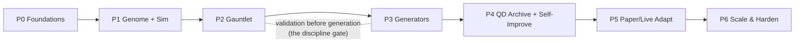

# 09 — Research Roadmap

> A phased build, sequenced so each phase produces a *usable* system and each is gated by a **go/no-go** criterion. Do not start a phase until the prior gate is green. The ordering is deliberate: **build the immune system before the idea factory**, so you never fall in love with an unvalidated backtest.

## Sequencing principle

The counter-intuitive move — **P2 (the gauntlet) before P3 (mass generation)** — is the most important scheduling decision in the whole program. Anyone can generate a thousand strategies in a weekend; only the immune system makes that safe. Build the referee before the tournament.

---

## Phase 0 — Foundations (data lake + reproducibility spine)
**Goal:** a point-in-time, survivorship-safe data lake and the registries that make results honest.

- Bulk-download Binance history → Parquet; wire OANDA v20 practice for FX + XAU; snapshot & content-hash datasets.
- Stand up the **Genome Registry**, **Result Ledger**, and **Lesson Library** (SQLite) with seed/snapshot discipline.
- Port your `core/smc_data.py` fetching + caching into the shared **feature store** (compute-once, PIT).

**Go/no-go:** you can pull any (symbol, timeframe, date) as-of a snapshot, reproducibly, including delisted symbols. Reproducibility test passes byte-for-byte.

---

## Phase 1 — Genome DSL + multi-fidelity simulator
**Goal:** represent a strategy as data and score it fast and honestly.

- Implement the **Strategy Genome** ([02](02_STRATEGY_GENOME_DSL.md)): typed nodes, registry, `hash/mutate/crossover/typecheck/to_prose`.
- Wrap your `backtest/engine.py` as **Tier 1**; build the **Tier 2 event-driven** simulator sharing the feature store + `costs.py`; stub **Tier 3** tick replay.
- Encode 3–5 of your existing SMC strategies *as genomes* to validate the DSL is expressive enough to represent what you already trust.

**Go/no-go:** a known SMC strategy, expressed as a genome, reproduces its hand-coded backtest within tolerance. If the DSL can't express your real strategies, fix the DSL before proceeding.

---

## Phase 2 — The Validation Gauntlet (build the immune system)
**Goal:** the ability to *disprove* a strategy with trial-count-correct rigor.

- Wire your `purged_cv.py` (G2), `smc_monte_carlo.py` (G5) into the gauntlet.
- Implement **CPCV → PBO** (G3) and **Deflated Sharpe** (G4) reading trial count from the Result Ledger.
- Add regime slicing (`xsec/regime.py`), parameter-plateau sensitivity, transfer/holdout (G6), capacity+cost-stress (G7), orthogonality (G8).
- Lock away a **holdout** the search will never see.

**Go/no-go — the critical gate:** feed the gauntlet *known-random* genomes and confirm it rejects them at the expected rate; feed it a *deliberately overfit* genome and confirm PBO/DSR flag it. **If the gauntlet can't catch a strategy you overfit on purpose, nothing downstream is trustworthy.** Do not proceed until this passes.

---

## Phase 3 — Generation engines
**Goal:** produce dozens of *diverse* candidates per day into the shared pool.

- **Template sampler** (D) first — cheapest, seeds diversity.
- **Evolutionary/GP** (A) via `deap`/`gplearn` on the genome graph, NSGA-II fitness from the gauntlet.
- **Factor miner** (C) on top of your `xsec/ic_report.py` IC machinery.
- **LLM proposer** (B) last — needs the Lesson Library to be worth its tokens.

**Go/no-go:** the pool sustains ≥ dozens of gauntlet-completed genomes/day, with measured behavioral diversity (niche coverage), and dedup working (no double-counted trials).

---

## Phase 4 — QD archive + self-improvement loop
**Goal:** the system reflects and compounds.

- Implement the **MAP-Elites archive** (niching by behavioral descriptor).
- Build the **attribution → LLM critic → Lesson Library → targeted re-test** cycle ([06](06_SELF_IMPROVEMENT_LOOP.md)); reuse `SMC_ML` SHAP diagnostics.
- Add the **bandit meta-controller** allocating generation/search budget by payoff.

**Go/no-go:** over a fixed compute budget, the archive's Pareto front and niche coverage *improve* generation-over-generation, and holdout performance does **not** diverge from archive performance (if it does, the loop is overfitting — tighten and re-run).

---

## Phase 5 — Paper trading + live adaptation
**Goal:** transition survivors to paper and prove backtests weren't fiction.

- Generalize `execution/shadow.py` to run any archive genome on a **live data feed through the same simulator**.
- Build the **regime-aware allocator** (`xsec/portfolio.py` + `Macro_Compass` gauge) and **drift detection** (Page-Hinkley/ADWIN + rolling PSR) + **circuit breakers**.
- Daily **Telegram** report from the critic: promoted, demoted, learned.

**Go/no-go:** paper track record tracks backtest expectation across ≥ N weeks and ≥ 2 regimes for the top niches; drift monitor demonstrably quarantines a decaying strategy. **This is the honest stopping point of the blueprint** — R2/R3 live capital is your separate, deliberate decision.

---

## Phase 6 — Scale & harden (continuous)
**Goal:** run unattended, safely, forever.

- Fan-out backtests to GitHub Actions; add feed-health heartbeat + HTTP backoff (your existing backlog items).
- Extend cross-market transfer (crypto ↔ FX ↔ XAU) as a first-class OOS test.
- Optional research tracks: LSTM sequence model, PPO execution agent (your `SMC_ML` Phases 3–4) — refinements, never foundations.
- Periodic **population-level audits** (White's Reality Check / SPA) over the whole archive.

**Go/no-go:** the "definition of done" in [00 §5](00_VISION_AND_REALITY.md) — a week unattended, generating, validating, papering, reporting, never self-authorizing live capital.

---

## Milestone summary

| Phase | Deliverable | The gate that protects you |
|---|---|---|
| P0 | Reproducible, survivorship-safe data lake | Byte-reproducibility |
| P1 | Genome DSL + multi-fidelity simulator | DSL reproduces a trusted strategy |
| **P2** | **Validation gauntlet** | **Catches a deliberately overfit strategy** |
| P3 | Four generation engines | Dozens diverse/day, dedup honest |
| P4 | QD archive + self-improvement | Improves without holdout divergence |
| P5 | Paper trading + adaptation | Live-paper tracks backtest |
| P6 | Unattended, hardened, scaled | The full "definition of done" |

## A note on pace

You asked for profitability "in a brief time." The roadmap is engineered to get you a *trustworthy* system quickly — but the phases you'll be tempted to rush (P2 especially) are exactly the ones that determine whether the profits are real or imaginary. The fastest path to *durable* results is to not skip the referee. Build P0–P2 properly and you'll already own something most retail algo traders never have: a machine that reliably tells you when you're fooling yourself.
