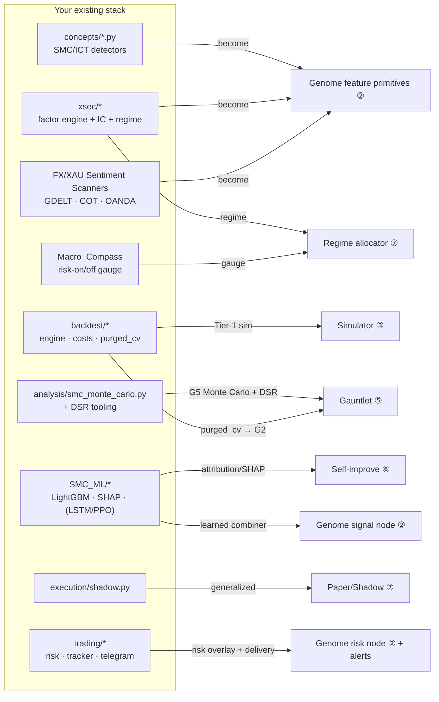

# 10 — Integration Map (Reusing What You've Built)

> You asked for architecture help, *not* to base the design on your existing code — but not to ignore it either. This document is the bridge: it shows exactly where your existing, battle-tested modules become organs of the larger system, so Master Trader is an *elevation* of your work, not a rewrite. Where a component is reused, the meta-layer treats it as one plug-in primitive among many — never as the foundation.

## 1. Reuse map at a glance

## 2. Component-by-component

| Your module | Role in Master Trader | Notes |
|---|---|---|
| `concepts/smc_*.py` (order blocks, FVG, liquidity, structure, AMD, DOL, IPDA, SMT, sessions, fib) | **Feature primitives** in the Genome DSL ([02](02_STRATEGY_GENOME_DSL.md)) — *one family among many, not privileged* | High-quality ready-made inputs that compete on equal footing with TA, statistical, microstructure, cross-asset, and random primitives. Already stateless pure functions — perfect DSL nodes. |
| `xsec/factors/*` (momentum, reversion, carry, basis, flow, smc) | **Feature primitives** + Factor-Miner baselines | The cross-sectional alpha vocabulary. |
| `xsec/neutralize.py`, `combine.py` | Neutralization ops + **signal-blend** operator | BTC-beta residualization becomes a DSL transform. |
| `xsec/ic_report.py`, `smc_ic_audit.py` | **Factor-Miner fitness** (IC/IR) ([03](03_GENERATION_ENGINES.md)) | Already computes the exact metric the miner needs. |
| `xsec/regime.py` | **Regime classifier** for the allocator + gauntlet G5 slicing | |
| `xsec/portfolio.py` | **Correlation-aware sizing** in the live allocator ([07](07_LIVE_ADAPTATION_AND_PORTFOLIO.md)) | |
| `backtest/engine.py` | **Simulator Tier 1** (vectorized screen) ([04](04_BACKTEST_SIMULATOR.md)) | "Same code path for backtest/shadow/live" principle generalized system-wide. |
| `backtest/costs.py` | **The one cost model**, charged at every tier | Non-negotiable in fitness. |
| `backtest/purged_cv.py` | **Gauntlet G2** (purged walk-forward) | Purge/embargo discipline extended to the whole search. |
| `analysis/smc_monte_carlo.py` + DSR | **Gauntlet G4/G5** (Deflated Sharpe, bootstrap) | You already flow return series into this — now every genome does. |
| `SMC_ML/*` (features, trainer, predictor, diagnostics) | **Learned signal node** + **attribution** for the critic ([06](06_SELF_IMPROVEMENT_LOOP.md)) | SHAP diagnostics feed the LLM post-mortem evidence pack. |
| `SMC_ML` Phase-3/4 (LSTM, PPO) | **Optional research tracks** | PPO stays at the *execution* layer — timing/sizing on validated signals, never open-ended discovery. |
| `execution/shadow.py` | **Paper/Shadow rung (R1)** ([07](07_LIVE_ADAPTATION_AND_PORTFOLIO.md)) | Generalized to run any archive genome on live data through the same simulator. |
| `trading/smc_trade.py`, `smc_tracker.py`, `smc_cost_filter.py` | **Risk-overlay primitives** + circuit breakers | Adaptive-risk grid becomes DSL sizing/risk nodes. |
| `trading/smc_telegram.py` + scanners' delivery | **Reporting & alerts** ([08](08_INFRASTRUCTURE_AND_DATA.md)) | Daily critic report, promotion/drift alerts. |
| FX/XAU **Sentiment Scanners** (GDELT, COT, calendar, OANDA feeds) | **Macro/sentiment feature primitives** + FX/XAU data ingestion | Sentiment scores become genome features; OANDA feed serves FX + gold. |
| `Macro_Compass` | **Risk-on/off gauge** for the regime allocator | The bearing, not the route — exactly its stated purpose. |
| `Past_Trading` (delisting probability) | **Survivorship-safe universe** construction ([08](08_INFRASTRUCTURE_AND_DATA.md)) | Delisted-symbol inclusion prevents survivorship bias. |
| `core/smc_database.py`, SQLite/WAL | **Registries & ledgers** substrate | Same storage pattern, new tables. |
| GitHub Actions deploys (scanners) | **Free burst-compute grid** for parallel backtests | Reuse the CI you already operate. |

## 3. What is genuinely new (the meta-layer)

These pieces don't exist in your stack yet — they are the "something nobody imagined" part, and they're what turn a collection of good strategies into a self-improving factory:

1. **The Strategy Genome DSL** ([02](02_STRATEGY_GENOME_DSL.md)) — the substrate that makes strategies searchable data. *The keystone.*
2. **Multi-fidelity simulator ladder** ([04](04_BACKTEST_SIMULATOR.md)) — Tier 2/3 event-driven + tick engines above your vectorized Tier 1.
3. **CPCV → PBO** and a unified, trial-count-honest **gauntlet** ([05](05_VALIDATION_GAUNTLET.md)) — you have the pieces (purged CV, MC, DSR); this assembles them into a single pass/fail immune system with correct multiple-testing accounting.
4. **MAP-Elites quality-diversity archive** ([06](06_SELF_IMPROVEMENT_LOOP.md)) — diversity as a first-class objective.
5. **LLM critic + Lesson Library** ([06](06_SELF_IMPROVEMENT_LOOP.md)) — the reflective, compounding-wisdom loop.
6. **Bandit meta-controller** — learning *how to generate and where to allocate*.

## 4. Migration stance

- **Don't rewrite; wrap.** Each existing module is adapted behind a thin interface (a DSL node, a fitness function, a simulator tier). Your code keeps running; Master Trader orchestrates it.
- **The existing SMC systems become the first archive occupants.** Encode `CC_Trading` and `FX_Trading` strategies as genomes ([09 Phase 1](09_RESEARCH_ROADMAP.md)); they seed the population with known-good, human-validated members — and their re-validation through the gauntlet is a great early test of the whole pipeline.
- **Reference, not foundation.** Per your instruction: these systems are *inputs and building blocks*, not the architecture. The architecture is the loop; your strategies are among the things flowing through it.
