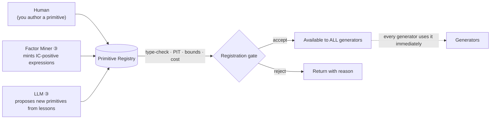

# 11 — Feature & Primitive Catalog

> The open-ended registry the generators pull from. This is the *vocabulary* of the [Strategy Genome DSL](02_STRATEGY_GENOME_DSL.md) — every typed building block a genome can wire together. It is intentionally a **seed list, not a ceiling**: new primitives are added continuously and every generator can use them the moment they're registered. Nothing here is privileged; SMC sits beside raw statistics sits beside random combinators, and the [Gauntlet](05_VALIDATION_GAUNTLET.md) decides what survives.

## 0. How to read this catalog

Each primitive is a small, typed, self-describing unit. The generators never manipulate code — they manipulate these declarations. A genome is just a wiring of registered primitive `id`s with argument values drawn from each primitive's declared ranges.

The catalog is organized by the five genome stages ([02 §2](02_STRATEGY_GENOME_DSL.md)): **Features → Signal → Sizing → Risk → Meta**. Features are by far the largest and most open-ended section — that's the point.

## 1. The primitive declaration schema (the contract)

Every primitive — whether hand-written, mined, or LLM-authored — must satisfy this contract before it enters the registry. The contract is what makes the whole system safe to expand: type info enables valid random assembly, arg bounds define the search space, PIT metadata prevents look-ahead, and provenance makes it auditable and versioned.

```yaml
primitive:
  id: "rsi"                      # unique, stable, content-referenced
  stage: "feature"              # feature | signal | sizing | risk | meta | transform
  summary: "Relative Strength Index over a window."
  inputs:  [{name: x, type: "Series[price]"}]
  output:  {type: "Series[osc_0_100]"}      # typed → generators only wire valid graphs
  args:
    - {name: window, type: int, range: [2, 300], prior: "log_uniform", default: 14}
  data_requires: ["ohlcv"]       # what feeds must exist for this to be computable
  timeframes: ["any"]            # or explicit set
  pit:                           # point-in-time / leakage contract
    lookback_bars: "= window"    # bars of history consumed
    uses_future: false           # MUST be false; enforced at registration
    closed_bar_only: true        # never reads the forming candle
  cost_class: "cheap"            # cheap | medium | heavy  (compute, for scheduling)
  tags: ["momentum", "oscillator", "classical_ta"]
  provenance: {source: "human", author: "curieux", version: "1.0.0", added: "2026-07-22"}
```

**Registration gate (automatic):** a primitive is rejected if it fails type-checking, declares `uses_future: true`, has unbounded args, or lacks a `data_requires` it can't be satisfied from. This is the front-door filter that keeps the vast space *valid* rather than chaotic.

## 2. The type system (why random wiring still type-checks)

Data types flow left-to-right through a genome and must match. This is what lets the generators assemble *valid* graphs at random — an op only connects to a compatible output.

| Type | Meaning | Example producers |
|---|---|---|
| `Series[price]` | A price-like series (close, VWAP, mid) | raw feeds, MAs |
| `Series[price_level]` | A reference price *level* (POC, VAH/VAL, HVN/LVN, IB) | volume/market profile, auction ops |
| `Series[return]` | Returns / differenced series | `pct_change`, `log_return` |
| `Series[osc_0_100]` | Bounded oscillator | RSI, Stochastic, ADX |
| `Series[zscore]` | Standardized, unbounded ~N(0,1) | `zscore`, `robust_z` |
| `Series[rank]` | Cross-sectional rank in [0,1] | `cs_rank` |
| `Series[binary]` | 0/1 condition | comparisons, pattern flags |
| `Series[categorical]` | Discrete label (regime, session) | HMM label, session tag |
| `Signal` | Directional conviction in [−1,+1] | signal-stage ops |
| `Position` | Target position / weight | sizing-stage ops |
| `OrderIntent` | Final risk-adjusted intent | risk-stage ops |
| `Scalar` | A single number (arg or reduction) | reductions, constants |

**Transform/combinator ops (below, §3.16) are type-polymorphic glue** — they take generic `Series` and return `Series`, which is precisely how *any* two families get interlinked ("in ways we can't imagine").

---

## 3. Stage 1 — Feature primitives (the open-ended universe)

Features are pure, stateless, point-in-time `Series → Series` transforms. The families below are the seed vocabulary. **Add relentlessly.** Where a family overlaps your existing code, that code is the *first* implementation, not the boundary of the family.

### 3.1 Price & return transforms
| id | output | key args | notes |
|---|---|---|---|
| `log_return` | `Series[return]` | `horizon∈[1,240]` | multi-horizon returns |
| `pct_change` | `Series[return]` | `horizon` | |
| `overnight_gap` | `Series[return]` | — | session-to-session gap |
| `range_pct` | `Series[return]` | — | (high−low)/close |
| `close_to_x` | `Series[return]` | `ref∈{open,vwap,prevclose}` | position within candle |
| `cum_return` | `Series[return]` | `window` | |

### 3.2 Moving averages & trend
| id | output | key args | notes |
|---|---|---|---|
| `sma`,`ema`,`wma`,`hma`,`dema`,`kama` | `Series[price]` | `window∈[2,400]` | MA family |
| `ma_distance` | `Series[zscore]` | `window`,`ma_type` | (price−MA)/ATR |
| `ma_cross` | `Series[binary]` | `fast`,`slow` | golden/death cross |
| `slope` | `Series[return]` | `window` | linreg slope |
| `adx` | `Series[osc_0_100]` | `window=14` | trend strength |
| `aroon`,`vortex`,`supertrend` | mixed | period, mult | trend indicators |

### 3.3 Momentum & oscillators
| id | output | key args | notes |
|---|---|---|---|
| `rsi` | `Series[osc_0_100]` | `window` | |
| `stoch`,`stoch_rsi` | `Series[osc_0_100]` | `k`,`d`,`window` | |
| `macd` | `Series[zscore]` | `fast`,`slow`,`signal` | line/hist variants |
| `cci`,`williams_r`,`roc`,`tsi`,`cmo` | mixed | window | oscillator zoo |
| `momentum_rank` | `Series[rank]` | `lookback`,`skip` | your `xsec` momentum |

### 3.4 Volatility
| id | output | key args | notes |
|---|---|---|---|
| `atr_pct` | `Series[return]` | `window=14` | ATR / close |
| `realized_vol` | `Series[return]` | `window` | close-to-close |
| `parkinson`,`garman_klass`,`yang_zhang` | `Series[return]` | `window` | range-based vol |
| `ewma_vol` | `Series[return]` | `halflife` | |
| `garch_vol` | `Series[return]` | `p`,`q` | conditional vol (heavy) |
| `bb_position`,`keltner_position`,`donchian_position` | `Series[osc_0_100]` | `window`,`mult` | band position |
| `vol_of_vol` | `Series[return]` | `window` | second-order vol |
| `atr_expansion` | `Series[zscore]` | `window` | current vs trailing ATR |

### 3.5 Volume & participation
| id | output | key args | notes |
|---|---|---|---|
| `obv`,`ad_line`,`cmf`,`mfi` | mixed | window | volume-price |
| `vwap_distance` | `Series[zscore]` | `anchor` | intraday/anchored |
| `volume_zscore` | `Series[zscore]` | `window` | |
| `rel_volume` | `Series[return]` | `window` | vs trailing avg |
| `dollar_volume` | `Series[price]` | — | for capacity/universe |

### 3.6 Microstructure & order flow
| id | output | key args | notes |
|---|---|---|---|
| `cvd` | `Series[zscore]` | `window` | cumulative volume delta (your `flow.py`) |
| `order_flow_imbalance` | `Series[zscore]` | `window` | aggressive buy−sell |
| `trade_size_skew` | `Series[zscore]` | `window` | large-print detection |
| `funding_rate`,`funding_zscore` | mixed | `window` | perp funding (crypto) |
| `open_interest`,`oi_change` | mixed | `window` | positioning proxy |
| `long_short_ratio` | `Series[zscore]` | — | exchange sentiment (crypto) |
| `liquidation_intensity` | `Series[zscore]` | `window` | squeeze fuel |
| `basis`,`roll_yield` | `Series[zscore]` | — | perp/spot & term structure |
> Order flow *proper* — cumulative delta, footprint imbalance, absorption/exhaustion — is treated as its own auction-theory family in §3.15, since it carries a distinct market model (the auction), not just more indicators.

### 3.7 Statistical & econometric
| id | output | key args | notes |
|---|---|---|---|
| `autocorr` | `Series[zscore]` | `lag`,`window` | |
| `variance_ratio` | `Series[zscore]` | `window`,`q` | trend vs mean-revert diagnostic |
| `hurst` | `Series[zscore]` | `window` | persistence |
| `kalman_trend` | `Series[price]` | `q`,`r` | adaptive trend |
| `rolling_skew`,`rolling_kurt` | `Series[zscore]` | `window` | tail shape |
| `entropy`,`fractal_dim` | `Series[zscore]` | `window` | complexity |
| `coint_residual` | `Series[zscore]` | `pair`,`window` | pairs/stat-arb spread |
| `pca_loading` | `Series[zscore]` | `k`,`window` | eigen-portfolio exposure |
| `zscore`,`robust_z`,`mad_z` | `Series[zscore]` | `window` | standardizers |

### 3.8 Pattern & shape
| id | output | key args | notes |
|---|---|---|---|
| `candlestick_pattern` | `Series[binary]` | `pattern` | engulfing, pin, doji, … |
| `shapelet_match` | `Series[osc_0_100]` | `template`,`window` | DTW similarity |
| `sr_density` | `Series[zscore]` | `window`,`bins` | support/resistance clustering |
| `breakout_distance` | `Series[zscore]` | `window` | vs N-bar high/low |
| `consolidation_score` | `Series[osc_0_100]` | `window` | range-tightness |

### 3.9 SMC / ICT — *one family among many, not privileged*
| id | output | key args | notes |
|---|---|---|---|
| `fvg_present`,`ifvg`,`bpr` | `Series[binary]` | `tf` | fair-value gaps (`concepts/smc_fvg.py`) |
| `order_block_strength` | `Series[osc_0_100]` | `tf` | 0–7 strength (`smc_orderblocks.py`) |
| `liquidity_swept` | `Series[binary]` | `tf` | BSL/SSL sweep (`smc_liquidity.py`) |
| `bos_choch_rank` | `Series[categorical]` | `tf` | structure break (`smc_structure.py`) |
| `displacement_atr` | `Series[zscore]` | `tf` | institutional candle |
| `in_ote_zone`,`premium_discount` | `Series[binary]` | `tf` | fib/OTE (`smc_fibonacci.py`) |
| `kill_zone_rank`,`session_tag` | `Series[categorical]` | — | ICT sessions (`smc_sessions.py`) |
| `amd_phase` | `Series[categorical]` | — | accumulation/manip/distribution |
| `smt_confirmed` | `Series[binary]` | `pair` | SMT divergence |
> These enter the pool as ready-made, high-quality inputs and must earn their keep through the Gauntlet exactly like any random expression. Valuable — not privileged.

### 3.10 Cross-asset & intermarket
| id | output | key args | notes |
|---|---|---|---|
| `ref_level`,`ref_return` | `Series[return]` | `symbol∈{DXY,XAU,WTI,US10Y,SPX,BTC.D,…}` | pull another instrument's series |
| `rolling_corr` | `Series[zscore]` | `symbol`,`window` | pairwise correlation |
| `lead_lag_beta` | `Series[zscore]` | `symbol`,`lag`,`window` | does gold lead the trade? |
| `risk_on_off` | `Series[zscore]` | — | `Macro_Compass` gauge |
| `dollar_regime` | `Series[categorical]` | — | DXY trend state |
> **This is where "interlinked in ways we can't imagine" concretely lives** — a crypto signal can be conditioned on a gold-vs-dollar move, and the data judges it.

### 3.11 Cross-sectional (universe-relative)
| id | output | key args | notes |
|---|---|---|---|
| `cs_rank` | `Series[rank]` | `field` | rank within universe |
| `cs_zscore` | `Series[zscore]` | `field` | demeaned/scaled cross-section |
| `beta_residual` | `Series[zscore]` | `factor=BTC` | your `neutralize.py` residualization |
| `sector_neutral` | `Series[zscore]` | `field`,`groups` | cluster-neutralized |
| `dispersion` | `Series[zscore]` | `window` | cross-sectional spread |

### 3.12 Regime, latent & ML-derived (features produced *by* models)
| id | output | key args | notes |
|---|---|---|---|
| `hmm_regime` | `Series[categorical]` | `n_states`,`window` | hidden-state label |
| `kmeans_regime` | `Series[categorical]` | `k` | clustered market state |
| `changepoint_flag` | `Series[binary]` | `method` | Page-Hinkley/BOCPD |
| `autoencoder_embed` | `Series[zscore]` | `dim`,`model_id` | learned latent feature (heavy) |
| `lgbm_prob` | `Series[osc_0_100]` | `model_id` | your `SMC_ML` win-prob as a feature |
| `vol_regime_tag` | `Series[categorical]` | `tiers` | calm/normal/high/extreme (your risk grid) |

### 3.13 Seasonality & calendar
| id | output | key args | notes |
|---|---|---|---|
| `time_of_day`,`day_of_week` | `Series[categorical]` | — | |
| `session_phase` | `Series[categorical]` | — | Asian/London/NY |
| `funding_proximity` | `Series[osc_0_100]` | — | bars to funding settlement |
| `event_proximity` | `Series[osc_0_100]` | `calendar` | bars to CPI/FOMC/NFP |
| `expiry_roll_window` | `Series[binary]` | — | futures roll periods |

### 3.14 Macro / sentiment / positioning
| id | output | key args | notes |
|---|---|---|---|
| `cot_zscore` | `Series[zscore]` | `report∈{legacy,TFF}` | CFTC positioning (asset-mgr vs lev-fund) |
| `news_sentiment` | `Series[zscore]` | `source`,`window` | GDELT/Finnhub (your scanners) |
| `event_surprise` | `Series[zscore]` | `calendar` | actual vs consensus |
| `fed_policy_bias` | `Series[zscore]` | `window` | CME-FedWatch-style stance: 1Y yield − FOMC target (FRED), z-scored; +hikes/−cuts |
| `fed_repricing` | `Series[zscore]` | `window` | rate-path repricing shock (vol-scaled Δ of the FedWatch expectation) |
| `macro_series` | `Series[zscore]` | `fred_id` | FRED rates/macro, PIT-lagged |
| `hawk_dove_score` | `Series[zscore]` | — | continuous −10..+10 stance (your FX backlog) |

### 3.15 Auction Market Theory & order flow

Auction Market Theory (Steidlmayer's Market Profile) models price as a **two-way auction** continuously seeking a *fair value* where trade is facilitated: price **advertises**, volume **confirms or rejects**. It reframes the tape as **balance** (rotational, value-building — mean-reverting) versus **imbalance** (directional, value-migrating — trending), and infers *who is in control* from where **volume and time** accumulate. Modern **order flow** (delta, footprint, absorption/exhaustion) is the tick-level instrument of the same idea. This family overlaps microstructure (§3.6) but adds the **profile / value-area / auction-state** lens, and it is the most **data-hungry** family in the catalog: the footprint primitives want `trades`/`aggTrades` (the Binance bulk dumps carry these, [08](08_INFRASTRUCTURE_AND_DATA.md)) or a reconstructed footprint; where only bar data exists they degrade to declared **proxies** (marked). Like SMC/ICT, it is *valuable, not privileged* — it earns its place through the Gauntlet.

**Volume / market profile & auction state** — bar-derivable *proxies* where noted (`data_requires: [ohlcv]`); true versions want `trades`:
| id | output | key args | notes |
|---|---|---|---|
| `volume_profile_poc` | `Series[price_level]` | `window`,`bins` | Point of Control — highest-volume price of the window |
| `value_area` | `Series[price_level]` | `window`,`va_pct=0.70` | VAH/VAL enclosing ~70% of volume |
| `dist_to_poc` | `Series[zscore]` | `window` | price distance to developing POC, in ATR (proxy: vol-weighted) |
| `value_area_position` | `Series[categorical]` | `window` | above / inside / below value |
| `naked_poc` | `Series[binary]` | `window` | untested prior-period POC acting as a magnet |
| `hvn_lvn` | `Series[categorical]` | `window`,`bins` | high- vs low-volume node (acceptance vs rejection) |
| `initial_balance` | `Series[price_level]` | `session` | first-hour IB high/low |
| `ib_extension` | `Series[zscore]` | `session` | range extension beyond the IB (conviction) |
| `open_type` | `Series[categorical]` | — | open-drive / test-drive / auction / rejection-reverse |
| `day_type` | `Series[categorical]` | — | trend / normal / normal-variation / neutral |
| `single_prints` | `Series[binary]` | `tf` | TPO single prints — fast, un-auctioned rejection |
| `poor_high_low` | `Series[binary]` | `window` | unfinished auction (weak, likely-revisited extreme) |
| `excess_tail` | `Series[zscore]` | `window` | auction excess / rejection-tail length |
| `balance_imbalance` | `Series[categorical]` | `window` | balanced (mean-revert) vs imbalanced (trend) |
| `rotation_factor` | `Series[zscore]` | `window` | TPO up/down rotation count (directional conviction) |
| `composite_poc` | `Series[price_level]` | `lookback_days` | multi-day composite value magnet |

**Order flow (delta / footprint)** — `data_requires: [trades]` (or a reconstructed footprint):
| id | output | key args | notes |
|---|---|---|---|
| `cumulative_delta` | `Series[zscore]` | `window` | signed aggressor volume (extends `cvd`, §3.6) |
| `delta_divergence` | `Series[zscore]` | `window` | price up while delta down → absorption warning |
| `delta_at_extremes` | `Series[zscore]` | `window` | delta printed at the session high/low (reversal fuel) |
| `bid_ask_imbalance` | `Series[zscore]` | `window` | per-level footprint imbalance |
| `stacked_imbalance` | `Series[binary]` | `n_levels` | consecutive lopsided levels (institutional footprint) |
| `absorption` | `Series[binary]` | `window` | large passive fills halting price at a level |
| `exhaustion` | `Series[binary]` | `window` | aggressor spike with no price follow-through |
| `iceberg_flag` | `Series[binary]` | — | hidden, replenishing resting liquidity |
| `trade_intensity` | `Series[zscore]` | `window` | trades/sec vs baseline (auction speed) |
| `aggressor_ratio` | `Series[return]` | `window` | market-buy vs market-sell share |
| `liquidity_vacuum` | `Series[binary]` | — | thin-book zones price traverses fast |
> These encode the same evidence institutional desks read — *where is value, is the auction balanced, is aggression being absorbed.* Bar-only markets get the proxy subset immediately; the footprint subset activates once `trades`/`aggTrades` land in the lake. Auction primitives register through the same §1 gate (typed, PIT-safe, bounded, cost-classed) as everything else.

### 3.16 Transform & combinator ops (the glue that interlinks everything)
Type-polymorphic `Series → Series` (or `Series×Series → Series`). **These are what let any two families combine.** The generators lean on these heavily to build interlinkages no human enumerated.

| id | output | notes |
|---|---|---|
| `lag`,`diff`,`ewm`,`rolling_mean/std/min/max` | `Series` | temporal glue |
| `zscore`,`rank`,`winsorize`,`clip`,`normalize` | `Series` | scaling/robustness |
| `add`,`sub`,`mul`,`div`,`ratio`,`spread` | `Series` | arithmetic on two features |
| `and`,`or`,`not`,`gt`,`lt`,`crosses_above/below` | `Series[binary]` | logic/comparison |
| `if_then_else` | `Series` | conditional blend |
| `interaction` | `Series` | product of two standardized features |
| `decay`,`accumulate`,`streak` | `Series` | stateful summaries |

---

## 4. Stage 2 — Signal operators (`Series* → Signal ∈ [−1,+1]`)
| id | args | notes |
|---|---|---|
| `threshold` | `feature`,`cmp`,`k` | single-condition |
| `gated_and` / `gated_or` | list of terms | your 5-gate logic generalized |
| `weighted_blend` | weights | z-score sum (your `combine.py` v1) |
| `ic_weighted_blend` | — | IC-weighted (your `xsec` v2) |
| `rank_cut` | `top_frac`,`bottom_frac` | cross-sectional long/short |
| `learned_head` | `model_id` | LightGBM/logistic combiner (`SMC_ML`) |
| `regime_switch` | `regime→sub-signal` | different logic per regime |

## 5. Stage 3 — Sizing operators (`Signal + risk state → Position`)
| id | args | notes |
|---|---|---|
| `fixed_fractional` | `f` | |
| `vol_target` | `target_ann_vol` | scale to a vol budget |
| `kelly_capped` | `cap` | fractional Kelly, capped |
| `atr_scaled` | `atr_mult` | risk-per-trade normalized |
| `confidence_scaled` | — | scale by signal × model-prob agreement |
| `equal_risk_contribution` | — | risk-parity across names (`portfolio.py`) |

## 6. Stage 4 — Risk-overlay operators (`Position → OrderIntent`)
| id | args | notes |
|---|---|---|
| `stop_atr` / `stop_structure` | `sl_mult` | ATR- or swing-based stop |
| `triple_barrier` | `tp`,`sl`,`max_bars` | López-de-Prado labels/exits |
| `take_profit_ladder` | levels | progressive TP (your `smc_tracker.py`) |
| `trailing_stop` | `trail` | |
| `max_holding` | `bars` | time stop |
| `caps` | `per_name`,`gross` | exposure limits |
| `corr_throttle` | `corr_cap` | reduce overlapping bets |
| `session_filter` | sessions | only trade certain windows |
| `dd_circuit_breaker` | `dd_limit` | strategy-level kill |

## 7. Stage 5 — Meta genes (govern the whole genome)
| gene | domain | notes |
|---|---|---|
| `market` | crypto \| fx \| xau | which venue/data |
| `universe` | named universe | survivorship-safe set |
| `timeframe` | {htf,mtf,ltf} | multi-TF |
| `rebalance` | cadence | |
| `regime_filter` | conditions | only act in regimes X |
| `cost_profile` | named model | **mandatory** — no genome scores without one |
| `direction_mode` | long \| short \| both | |

---

## 8. Expansion hooks (how the registry keeps growing)

The catalog is designed to be *added to constantly* — that is the entire ethos ([README principle 3](../README.md)). Three sources feed it, all through the same front door (§1 contract):



**Acceptance checklist (enforced at registration):**
1. **Typed** — declares input/output types; wires validly into the graph.
2. **PIT-safe** — `uses_future: false`, `closed_bar_only: true`, honest `lookback_bars`. This is non-negotiable; a leaky primitive poisons every genome that uses it.
3. **Bounded args** — every arg has a range + sampling prior, so the search space is finite and the generators can sample it.
4. **Satisfiable data** — `data_requires` maps to feeds you actually have (or the primitive is inert on markets lacking them, and simply skipped).
5. **Cost-classed** — labeled cheap/medium/heavy so the [Simulator](04_BACKTEST_SIMULATOR.md) schedules it sensibly.
6. **Versioned & provenanced** — `source/author/version/added`. A new version is a new content-hash, so old results stay reproducible.

**Mined & LLM-authored primitives get extra scrutiny:** they are the most overfitting-prone, so (a) each is charged to the [trial count](05_VALIDATION_GAUNTLET.md#3-the-trial-count-ledger-the-honesty-backbone) for the Deflated Sharpe, and (b) a "no economic story" flag routes them to stricter out-of-sample testing. They are *not* blocked for lacking a story — breadth is the point — they are just held to a higher evidentiary bar.

## 9. Point-in-time & cost annotations (the two rules that never bend)

Regardless of family, **two** properties are checked for every primitive on every bar:

- **No look-ahead.** Computed only on closed bars, using only past data, with the declared lookback. The [Simulator](04_BACKTEST_SIMULATOR.md#4-correctness-guarantees-anti-leakage-by-construction) enforces this at runtime as a backstop to the registration check.
- **Cost-awareness downstream.** A feature is free to be exotic, but the genome that uses it still pays the [cost model](04_BACKTEST_SIMULATOR.md#3-realistic-execution-modeling-where-paper-profits-go-to-die-honestly) on the turnover it induces. Exotic features that only "work" gross-of-cost die in the Gauntlet.

## 10. How the generators consume this catalog

- **Type-directed assembly.** A generator picks an output type it needs and samples only primitives that produce it — so even fully random genomes are structurally valid.
- **Prior-guided sampling.** Arg priors (log-uniform windows, etc.) focus the search on sensible regions without hard-coding beliefs about *which family* wins.
- **Tag-based hypotheses.** The LLM proposer ([03](03_GENERATION_ENGINES.md)) reasons over `tags` ("combine a `mean_reversion` feature with a `funding` feature under a `high_vol` regime filter") and compiles to concrete primitive ids.
- **Novelty targeting.** Empty niches in the [QD archive](06_SELF_IMPROVEMENT_LOOP.md) bias primitive selection toward under-used families — actively pushing the search *outward*, never letting it collapse onto one school.

---

*This catalog is a living document. Its size is a feature, not a liability — the [Validation Gauntlet](05_VALIDATION_GAUNTLET.md) is precisely the machinery that lets it grow without limit while keeping your conclusions honest. Add primitives freely; let the immune system do the pruning.*
